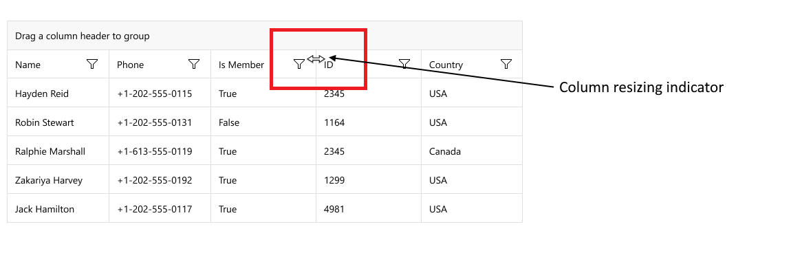
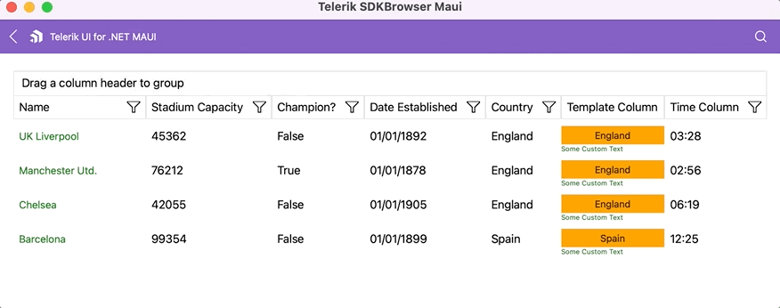
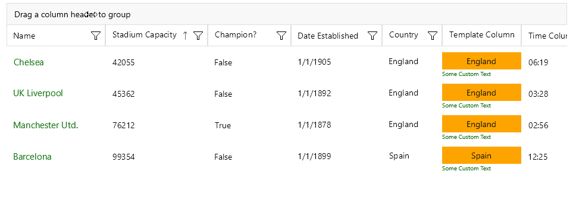

# .NET MAUI DataGrid Column Resizing

Columns inside the Telerik .NET MAUI DataGrid are resizable by default. The feature is available only on Desktop - WinUI and MacCatalyst.

On WinUI and MacOS you can change the column width by positioning the mouse over the columns vertical grid line (in the column header) and dragging it until the desired size is achieved.



**Column Resizing on MacCatalyst**



To resize a column programatically, you can use the columns `Width` property. For more details review the [Columns Width]() article.

In addition, you can set a `MinimumWidth`(`double`) to the column. This property is applicable when setting `SizeMode` column property to `Fixed`. When `MinimumWidth` is set, you can not reduce the width of the column to a value lower than the `MinimumWidth`. 

## Disabling Resizing

There are two ways to disable the resizing.

**1.** Disable the resizing on a DataGrid level 

You can disable the resizing by setting the `CanUserResizeColumns` property to `False`. The default value is `True`.

```XAML
<telerik:RadDataGrid x:Name="grid" 
                     CanUserResizeColumns="False"/>
```

>note When disabling the resizing on a DataGrid level, all of the columns won't be resizable.

**2.** Disable the resizing on a column level

In order to disable the resizing on a specific column set the `IsResizable` property. The default value is `True`.

```XAML
<telerik:DataGridNumericalColumn PropertyName="StadiumCapacity" 
                                 HeaderText="Stadium Capacity"
                                 IsResizable="False"/>
```



## See Also

- [Column Reordering]()
- [Column Header]()
- [Column Footer]()
