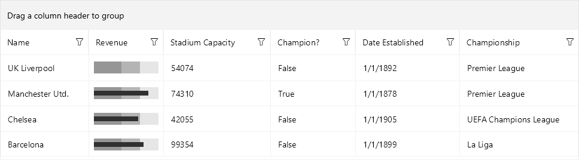

# .NET MAUI DataGrid SkiaSharp Cell Renderer

This article describes how to extend the functionality of a [.NET MAUI DataGrid]() column and render custom cell content when the DataGrid is rendered with the SkiaSharp library. 

* `CellRenderer`(`DataGridCellRenderer`)&mdash;Defines a renderer that allows custom rendering of cells when the DataGrid is rendered with SkiaSharp. To use this in iOS and MacCatalyst, the `RadDataGrid`.`RenderMode` needs to be set to `SkiaSharp`.

>Check the [Render Mode]() topic for more information on the DataGrid SkiaSharp rendering.

The `DataGridCellRenderer` provides the following methods you can override to define any custom SkiaSharp content inside each cell:

* `MeasureContainer`&mdash;Returns the desired size for the current item in device independent pixels.
* `RenderContainer`&mdash;Renders any custom content for the current item. Invoke the base implementation of this method if you want to render the default render content.

## Example

Check below an example on how to add a BulletGraph control as a content of the DataGrid TextColumn.

**1.** Add a sample DataGrid definition which presents information about `Club` objects. The corresponding for the `Revenue` property TextColumn uses a custom `CellRenderer` which renders a SkiaSharp bullet graph.

<snippet id='datagrid-columns-skiacellrenderer' />

**2.** Add the custom CellRenderer to the page's resources:

<snippet id='datagrid-columns-skiacellrenderer-resource' />

**3.** Here is the `CustomColumnRenderer` class which inherits from `DataGridCellRenderer` and overrides its `RenderContainer` method:

<snippet id='datagrid-column-datagridcellrenderer' />

**4.** Add the ViewModel class:

<snippet id='datagrid-column-view-model' />

**5.** Add the `Club` data object:

<snippet id='datagrid-club-model' />

**6.** The last step is to set the `ViewModel` class as a binding context of the page:

<snippet id='datagrid-selection-setvm' />

Here is the result:

## See Also
- [Render Mode]()
