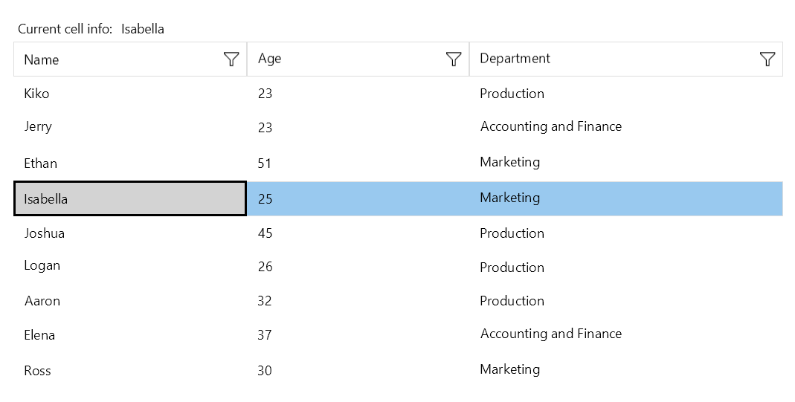

# .NET MAUI DataGrid Current Cell

The Telerik UI for .NET MAUI DataGrid provides options for configuring the behavior and style of its current cell.

## Setting the Behavior

The DataGrid allows you to use the `CurrentCell` property of type `DataGridCellInfo` to programmatically modify the current cell during keyboard navigation, when using the mouse, and so on.

The DataGrid also supports the `CurrentCellChanged` event which is invoked when the current cell changes as a result of user interaction with the keyboard.

The `CurrentCellChanged` event handler receives the following parameters:

* The sender argument, which is of type `object`, but can be cast to the `RadDataGrid` type.
* A `CurrentCellChangedEventArgs` object, which provides the following properties:
	- `OldCurrentCell`&mdash;Gets the previous `CurrentCell`.
	- `NewCurrentCell`&mdash;Gets the new `CurrentCell`.

## Styling the Cell

You can also style the current DataGrid cell by using the `CurrentCellStyle` of type `DataGridBorderStyle` and applying the `BackgroundColor`, `BorderColor`, and `BorderThickness` properties.

## Example

The following example shows the full implementation of the configurations for the current DataGrid cell.

**1.** Set the `ViewModel`.

<snippet id='datagrid-grouping-propertygroupdescriptor-viewmodel' />

**2.** Set the `Business` object.

<snippet id='datagrid-grouping-propertygroupdescriptor-object' />

**3.** Provide the DataGrid definition in XAML.

<snippet id='datagrid-keyboard-navigation-xaml' />

**4.** Set the style for the `CurrentCellStyle` that is defined in the page resources.

<snippet id='datagrid-keyboard-navigation-style' />

**5.** Set the `CurrentCellChanged` event.

<snippet id='datagrid-currentcell-changed' />

The following image shows the end result.

## Additional Resources

- [.NET MAUI DataGrid Product Page](https://www.telerik.com/maui-ui/datagrid)
- [.NET MAUI DataGrid Forum Page](https://www.telerik.com/forums/maui?tagId=1801)
- [Telerik .NET MAUI Blogs](https://www.telerik.com/blogs/mobile-net-maui)
- [Telerik .NET MAUI Roadmap](https://www.telerik.com/support/whats-new/maui-ui/roadmap)

## See Also

- [Setting the .NET MAUI DataGrid Columns]()
- [Grouping in the DataGrid]()
- [Using the DataGrid Commands]()
- [Sorting .NET MAUI DataGrid Records]()
- [Filtering .NET MAUI DataGrid Records]()