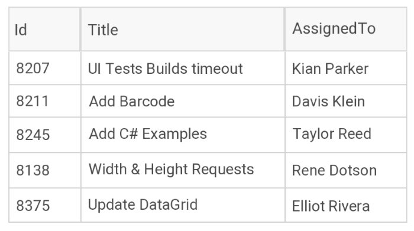

# Overview

Most of the data on the Internet is stored in tables within a database. **Telerik UI for .NET MAUI DataGrid** provides the same abstraction over the data&mdash;it has columns and rows, and the intersection of a row and a column is called a cell. When the data from a database is sent to the client, it is usually converted to a Business object (or the so-called `ViewModel`) where each instance represents a table row and each property of the object represents a column within the original table.

Currently, the Telerik UI for .NET MAUI DataGrid is available for Android and iOS.

## Key Features

* [Different column types]()&mdash;The DataGrid provides plenty of built-in columns such as Text, Boolean, Numeric, ComboBox, DateTime, and Template. These predefined templates allow you to handle different data types and user scenarios, each with its specific editor.

* [Load on demand]()&mdash;In some cases, you may need to load data in the DataGrid when the control is already displayed as this can improve the performance of your application. The DataGrid offers automatic data loading once the user scrolls to the last available record, or by displaying a customizable button which will initiate the loading of more data items.

* [Commands]()&mdash;The DataGrid allows you to attach commands, such as `ColumnHeaderTap`, `CellTap`, `BeginEdit`, and more, which will be executed when certain actions occur.

* UI Virtualization&mdash;The highly optimized data layer of the DataGrid enables fast grouping, sorting, and filtering operations. The user interface uses virtualization for its row and cell elements, which means that visual elements are created only when needed and only for the currently visible cells.

* [Editing]()&mdash;You can enable users to edit the data presented in the DataGrid. Depending on the column data type, a relevant editor allows end users to edit content in a friendly environment. For example, if one of the columns is a date, a date-picker will be used to offer a change in the date field.

* [Sorting](), [filtering](), and [grouping]()&mdash;You can easily perform SORT, FILTER, and GROUP operations on your data by using the convenient API of the control.

* [Selection modes]()&mdash;The DataGrid features a single or a multiple-item selection and provides options for controlling the cell or row selection unit, thus enabling any selection scenario you want your MAUI application users to have.

* Rows alternation&mdash;The DataGrid supports alternating row colors so that your users can easily distinguish one row from another.

* [Flexible styling API]()&mdash;The DataGrid is highly customizable if you prefer to use your own styling.

## See Also

- [Getting Started with Telerik UI for .NET MAUI DataGrid]()
