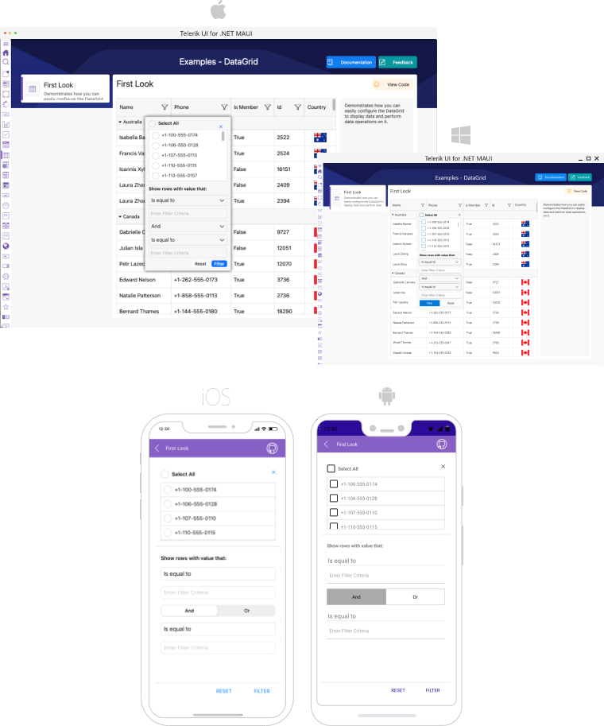

# Filtering

The DataGrid supports filtering through the UI - [Filtering UI](#filtering-ui) and [programmatic filtering](#programmatic-filtering).


## Filtering UI

> On Mobile (iOS and Android) Filtering UI appears when clicking the options icon (**OptionsButton**, three dots) on each column's header and it allows the user to easily filter data by column values.
>
> On Desktop Filtering UI appears when clicking on the filtering icon on each column's header'.



The Filtering UI exposes the following property:

* `UserFilterMode`&mdash;Defines whether the Filtering UI is enabled/disabled. The available options are *Auto/Enabled/Disabled*. The default value of the UserFilterMode is *Auto*. Set the property on DataGrid control.

* `CanUserFilter`(`bool`) property is used to enable/disable the filtering of a specific column. Set the property to a specific column.

* `ShowDistinctValuesFilter`(`bool`)&mdash;Defines whether the distinct values are included int he Filering UI. By default the value is true.

## FilterControl Template

The Telerik DataGrid allows you to apply filtering to the datagrid column using the FilterControlTemplate property.

* **FilterControlTemplate**(DataTemplate): Specifies the user defined template used for Filtering UI. The template must contain an instance of the Telerik.XamarinForms.DataGrid.DataGridFilterControlBase class

## Programmatic Filtering

Programmatic filtering is achieved by adding different filter descriptors in the `FilterDescriptor` collection of the control.

The following descriptor types are supported:

* [TextFilterDescriptor](#text-filter-descriptor)
* [NumericalFilterDescriptor](#numerical-filter-descriptor)
* [DateTimeFilterDescriptor](#datetime-filter-descriptor)
* [TimeSpanFilterDescriptor](#timespan-filter-descriptor)
* [BooleanFilterDescriptor](#boolean-filter-descriptor)
* [NestedPropertyTextFilterDescriptor](#nested-property-text-filter-descriptor)
* [DistinctValuesFilterDescriptor](#distinct-values-filter-descriptor)
* [CompositeFilterDescriptor](#composite-filter-descriptor)
* [DelegateFilterDescriptor](#delegate-filter-descriptor)

All `FilterDescriptors` are located in the `Telerik.XamarinForms.Common.Data` namespace:

```C#
using Telerik.XamarinForms.Common.Data;
```

### Text Filter Descriptor

The `TextFilterDescriptor` supports the following properties:

* `PropertyName`&mdash;Gets or sets the name of the property that is used to retrieve the filter value.
* `Operator`&mdash;Gets or sets the `TextOperator` value that defines how the `Value` member is compared with each value from the items source.
* `Value`&mdash;Gets or sets the value used in the comparisons. This is the right operand of the comparison.
* `IsCaseSensitive`&mdash;Gets or sets a value that determines whether the text comparisons will be case-sensitive. The default value is `True`.

To use `TextFilterDescriptor`, you need to add its instance to the `RadDataGrid.FilterDescriptors` collection and to set its `PropertyName` property to associate it with the property from your custom objects. Then, through the `Operator` and `Value` properties, you need to set the filter condition and the value to compare. You can also use the `IsCaseSensitive` property to determine if the text comparisons will be case-sensitive or not.

<snippet id='datagrid-textfilterdescriptor-xaml'/>
```XAML
<telerikCommon:TextFilterDescriptor PropertyName="Country"
                             Operator="StartsWith"
                             IsCaseSensitive="False"
                             Value="En"/>
```

### Numerical Filter Descriptor

The `NumericalFilterDescriptor` represents a descriptor which filters by properties of the `numerical` data type.

It exposes the following properties:

* `PropertyName`&mdash;Gets or sets the name of the property that is used to retrieve the filter value.
* `Value`&mdash;Gets or sets the value used in the comparisons. This is the right operand of the comparison.
* `Operator`&mdash;Gets or sets the `NumericalOperator` value that defines the boolean logic behind the left and right operand comparison.

<snippet id='datagrid-numericalfilterdecsriptor-xaml'/>
```XAML
<telerikCommon:NumericalFilterDescriptor PropertyName="StadiumCapacity"
                                  Operator="IsLessThan"
                                  Value="80000"/>
```

### DateTime Filter Descriptor

The `DateTimeFilterDescriptor` is a descriptor which filters by properties of the `System.DateTime` data type.

It exposes the following properties:

* `PropertyName`&mdash;Gets or sets the name of the property that is used to retrieve the filter value.
* `Value`&mdash;Gets or sets the value used in the comparisons. This is the right operand of the comparison.
* `Operator`&mdash;Gets or sets the `NumericalOperator` value that defines the boolean logic behind the left and right operand comparison.

<snippet id='datagrid-datetimefilterdescriptor-xaml'/>
```XAML
<telerikCommon:DateTimeFilterDescriptor PropertyName="Established"
                                 Operator="IsLessThan"
                                 Value="1900/01/01"/>
```

### TimeSpan Filter Descriptor

The `TimeSpanFilterDescriptor` is a descriptor which filters by properties of the `System.TimeSpan` data type.

It exposes the following properties:

* `PropertyName`&mdash;Gets or sets the name of the property that is used to retrieve the filter value.
* `Value`&mdash;Gets or sets the value used in the comparisons. This is the right operand of the comparison.
* `Operator`&mdash;Gets or sets the `NumericalOperator` value that defines the boolean logic behind the left and right operand comparison.

<snippet id='datagrid-datetimefilterdescriptor-xaml'/>
```XAML
<telerikCommon:TimeSpanFilterDescriptor PropertyName="Time"
                                 Operator="IsLessThan"
                                 Value="22/11/21"/>
```

### Boolean Filter Descriptor

The `BooleanFilterDescriptor` is a descriptor which filters by properties of the `System.Boolean` data type.

It exposes the following properties:

* `PropertyName`&mdash;Gets or sets the name of the property that is used to retrieve the filter value.
* `Value`&mdash;Gets or sets the value used in the comparisons. This is the right operand of the comparison.

<snippet id='datagrid-booleanfilterdescriptor-xaml'/>
```XAML
<telerikCommon:BooleanFilterDescriptor PropertyName="IsChampion"
                                Value="true"/>
```

### Nested Property Text Filter Descriptor

The `NestedProprtyTextFilterDescriptor` is a descriptor which filters the nested properties.

It exposes the following properties:

* `PropertyName`&mdash;Gets or sets the name of the property that is used to retrieve the filter value.
* `Operator`&mdash;Gets or sets the `TextOperator` value that defines how the `Value` member is compared with each value from the items source.
* `Value`&mdash;Gets or sets the value used in the comparisons. This is the right operand of the comparison.
* `IsCaseSensitive`&mdash;Gets or sets a value that determines whether the text comparisons will be case-sensitive. The default value is `True`.

<snippet id='datagrid-datetimefilterdescriptor-xaml'/>
```XAML
<telerikCommon:NestedProprtyTextFilterDescriptor PropertyName="Address"
                                 Operator="Contains"
                                 IsCaseSensitive="Falses"
                                 Value="Barcelona"/>
```

### Distinct Values Filter Descriptor

The `DistinctValuesFilterDescriptor` is a descriptor which filters by distinct values.

It exposes the following properties:

* `PropertyName`&mdash;Gets or sets the name of the property that is used to retrieve the filter value.
* `Value`&mdash;Gets or sets the value used in the comparisons. This is the right operand of the comparison.

<snippet id='datagrid-datetimefilterdescriptor-xaml'/>
```XAML
<telerikCommon:DistinctValuesFilterDescriptor />
```

### Composite Filter Descriptor

The `CompositeFilterDescriptor` represents a special `FilterDescriptorBase` that stores an arbitrary number of other descriptors instances. The logical `AND` or `OR` operator is applied upon all composed filters to determine the result of the `PassesFilter` routine.

<snippet id='datagrid-compositefilterdescriptor-xaml'/>
```XAML
<telerikCommon:CompositeFilterDescriptor Operator="And">
	<telerikCommon:CompositeFilterDescriptor.Descriptors>
		<telerikCommon:NumericalFilterDescriptor PropertyName="StadiumCapacity"
                                          Operator="IsGreaterThan"
                                          Value="55000"/>
			<telerikCommon:NumericalFilterDescriptor PropertyName="StadiumCapacity"
                                              Operator="IsLessThan"
                                              Value="85000"/>
	</telerikCommon:CompositeFilterDescriptor.Descriptors>
</telerikCommon:CompositeFilterDescriptor>
```

### Delegate Filter Descriptor

The `DelegateFilterDescriptor` exposes the `Filter` property, which gets or sets the `IFilter` implementation used to check whether a data item passes the filter or not.

To use a `DelegateFilterDescriptor`, you need to create a class that implements the `IFilter` interface which will return the `Key` by which you want to filter.

Then, you need to add a `DelegateFilterDescriptor` to the `RadDataGrid.FilterDescriptors` collection and set its `Filter` property.

The following example demonstrates the `CustomFilter` implementation:

<snippet id='datagrid-delegatefilterdescriptor-csharp'/>
```C#
class CustomFilter : IFilter
{
	public bool PassesFilter(object item)
 	{
		if ((item as Club).StadiumCapacity > 60000 && (item as Club).StadiumCapacity <85000)
        {
			return true;
        }
        else
        {
			return false;
        }
	}
}
```

Add the `DelegateFilterDescriptor` to the `RadDataGrid` instance:

<snippet id='datagrid-delegatefilterdescriptor-added'/>
```C#
dataGrid.FilterDescriptors.Add(new DelegateFilterDescriptor() { Filter = new CustomFilter()});
```

## See Also

- [Grouping]()
- [Sorting]()
- [Selection]()
