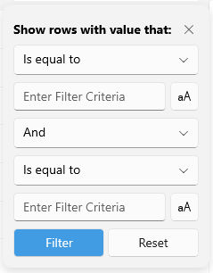

# Filter Control Template

The [Telerik UI for .NET MAUI DataGrid]() provides a built-in Filtering UI which enables users to quickly filter the displayed data. To customize the built-in Filtering UI for a concrete column, use the `FilterControlTemplate` property of the typed columns (text, boolean, numeric, date, time, and picker columns). 

In addition, as the [template column]() does not provide a default Filtering UI, with the `FilterControlTemplate` property you can allow users to filter data in template columns as well.

* `FilterControlTemplate`(`DataTemplate`)&mdash;Specifies the user defined template used for Filtering UI. The template must contain an instance of the `Telerik.Maui.Controls.Compatibility.DataGrid.DataGridFilterControlBase` class. 

The DataGrid provides the following predefined filter controls which are applied depending on the column type:

* `DataGridTextFilterControl`
* `DataGridNumericFilterControl`
* `DataGridBooleanFilterControl`
* `DataGridDateTimeFilterControl`
* `DataGridTimeFilterControl`
* `DataGridComboBoxFilterControl`

The `FilterControlTemplate` property of the columns allows you to customize its corresponding filter control. If the default filter control does not meet the requirements, you can create a custom filter control from scratch. 

## Example with Modified TextFilterControl

The example below shows how to apply the `DataGridTextFilterControl` as a `FilterControlTemplate` of the text column and set the filter match case options to `False`. This means that the toggle buttons inside the filter template for switching to case-sensitive filter will be untoggled when the Filtering UI appears.

```XAML
<telerik:RadDataGrid x:Name="dataGrid"
                     ItemsSource="{Binding GridSource}"
                     AutoGenerateColumns="False"
                     UserEditMode="Cell">
    <telerik:RadDataGrid.Columns>
        <telerik:DataGridNumericalColumn PropertyName="Population"
                                         CanUserFilter="False"/>
        <telerik:DataGridTextColumn PropertyName="Name">
            <telerik:DataGridTextColumn.FilterControlTemplate>
                <DataTemplate>
                    <telerik:DataGridTextFilterControl IsFirstDescriptorCaseSensitive="False"
                                                       IsSecondDescriptorCaseSensitive="False" />
                </DataTemplate>
            </telerik:DataGridTextColumn.FilterControlTemplate>
        </telerik:DataGridTextColumn>
    </telerik:RadDataGrid.Columns>
</telerik:RadDataGrid>
```
Here is the `DataGridTextFilterControl` with the match case properties applied:



## Example with a custom filter control

Check a quick example on how to create a custom `FilterControlTemplate` below.

**1.** Add the following snippet to declare a sample CityFilterControl - it should inherit from `Telerik.Maui.Controls.Compatibility.DataGrid.DataGridFilterControlBase`:

<snippet id='datagrid-filter-template-filtercontrolbase' />

**2.** Here is the code behind of the CityFilterControl:

<snippet id='datagrid-filter-template-filtercontrolbase-code' />

**3.** Add the `RadDataGrid` instance - you'd need to manually define the columns and apply the custom Filter Control Template through the `FilterTemplate` property:

<snippet id='datagrid-filter-template-xaml' />

Check the result below:


## See Also

- [Columns Overview]()
- [Filtering UI]()
- [Programmatic Filtering]()
