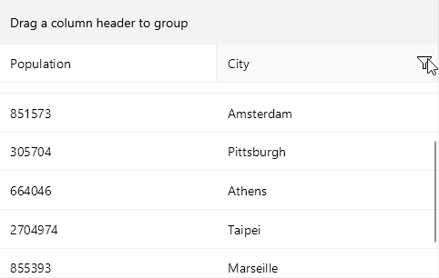

# Filter Control Template

The Telerik DataGrid provides a built-in filtering UI which enables users to quickly filter the displayed data. To customize the built-in filtering UI for a concrete column, use the `FilterControlTemplate` property of the typed columns (text, boolean, numeric, date, time, and picker columns). 

In addition, as the template column does not provide a default filtering UI, with the `FilterControlTemplate` property you can allow users to filter data in template columns as well.

* `FilterControlTemplate`(`DataTemplate`)&mdash;Specifies the user defined template used for Filtering UI. The template must contain an instance of the `Telerik.Maui.Controls.Compatibility.DataGrid.DataGridFilterControlBase` class. 

Check a quick example on how to create a custom `FilterControlTemplate` below.

**1.** Add the following snippet to declare a sample CityFilterControl - it should inherit from `Telerik.Maui.Controls.Compatibility.DataGrid.DataGridFilterControlBase`:

<snippet id='datagrid-filter-template-filtercontrolbase' />

**2.** Here is the code behind of the CityFilterControl:

<snippet id='datagrid-filter-template-filtercontrolbase-code' />

**3.** Add the `RadDataGrid` instance - you'd need to manually define the columns and apply the custom Filter Control Template through the `FilterTemplate` property:

<snippet id='datagrid-filter-template-xaml' />

Check the result below:

## See Also

- [Columns Overview]()
- [Filtering UI]()
- [Programmatic Filtering]()
