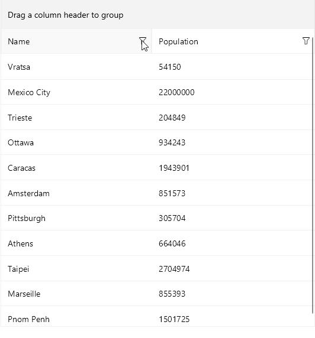

# Filtering UI

The [.NET MAUI DataGrid]() supports filtering through the UI.

> Filtering UI appears when clicking on the filtering icon on each column's header'.

The Filtering UI exposes the following properties:

* `UserFilterMode`&mdash;Defines whether the Filtering UI is enabled/disabled. The available options are `Auto`, `Enabled`, and `Disabled`. The default value of the `UserFilterMode` is `Auto`. Set the property on DataGrid control.

* `CanUserFilter`(`bool`) property is used to enable/disable the filtering of a specific column. Set the property to a specific column.

* `ShowDistinctValuesFilter`(`bool`)&mdash;Defines whether the distinct values are included in the Filtering UI. By default the value is true.

* `FilterContentTemplate`(`DataTemplate`)&mdash;Defines the content template of the DataGrid Columns Filter and overriding the default template.

Events related to `DistinctValuesFilter`:

* `DistinctValuesLoading` event&mdash;Occurs when loading the distinct values that will be displayed in the `Telerik.Maui.Controls.Compatibility.DataGrid.DataGridDistinctValuesFilterView`. The `DistinctValuesLoading` event handler receives two parameters:
	* The sender argument, which is of type object, but can be cast to the `RadDataGrid` type.
	* A `DistinctValuesLoadingEventArgs` object, which provides the following properties:
		- `DistinctValues`&mdash;Is a property which specifies a list of values of type `IEnumerable` which are to be displayed in the `DataGridDistinctValuesFilterView`.
		- `Column`&mdash;Is a readonly property of type `DataGridColumn` which gets the column for which the distinct values are being loaded.

