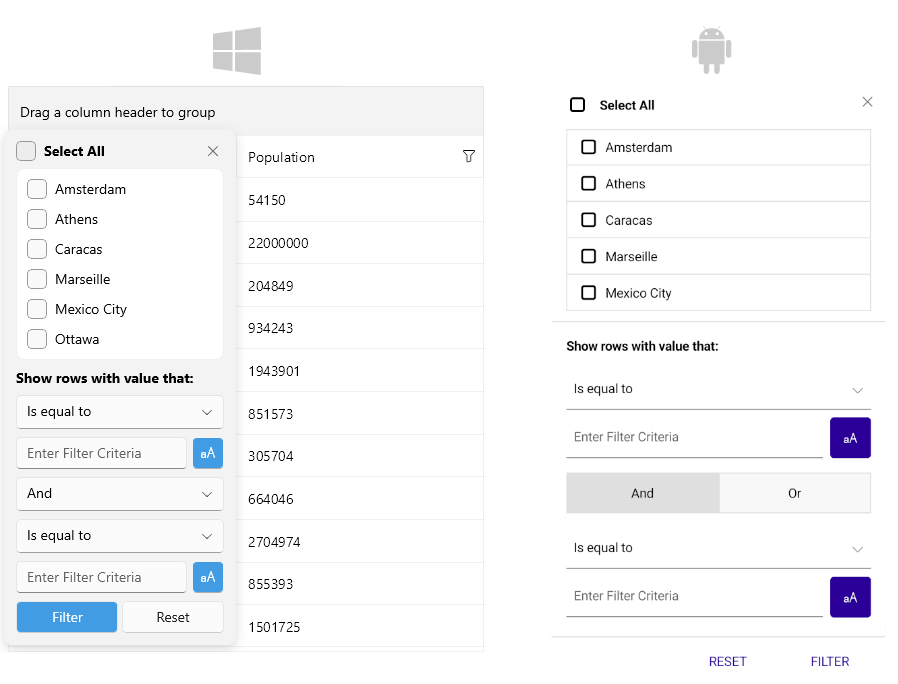

# .NET MAUI DataGrid Filtering

The [Telerik UI for .NET MAUI DataGrid]() supports filtering operations either through the UI - using the Filtering UI or programmatically.

## Filtering UI

> The filtering UI appears when clicking the filtering icon in each column's header.

## Filter Control Template

The Telerik DataGrid allows you to apply custom filter control to the DataGrid column using the `FilterControlTemplate` property.

* `FilterControlTemplate`(`DataTemplate`)&mdash;Specifies the user defined template used for Filtering UI. The template must contain an instance of the `Telerik.Maui.Controls.Compatibility.DataGrid.DataGridFilterControlBase` class.

>tip Go to the [Filter Control Template]() topic for detailed information about how to create a custom filter control.

## Programmatic Filtering

Programmatic filtering is achieved by adding different filter descriptors in the `FilterDescriptor` collection of the control.

>tip Go to the [Programmatic Filtering]() topic for detailed information about the provided filter descriptors.

>tip For an outline of all DataGrid features review the [.NET MAUI DataGrid Overview]() article.

## See Also

- [Filtering UI]()
- [Filter Control Template]()
- [Programmatic Filtering]()
