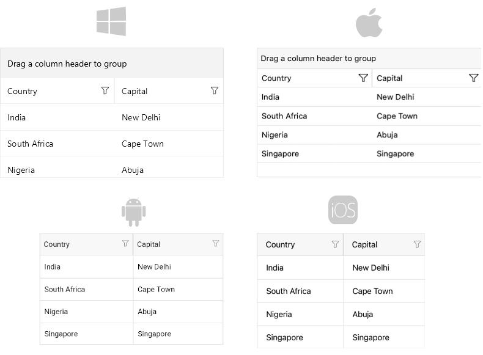

# Getting Started with the .NET MAUI DataGrid

This guide provides the information you need to start using the [Telerik UI for .NET MAUI DataGrid]() by adding the control to your project.

At the end, you will achieve the following result.



## Prerequisites

Before adding the DataGrid, you need to:

1. [Set up your .NET MAUI application](#step-1-set-up-your-net-maui-application).

1. [Download Telerik UI for .NET MAUI](#step-2-download-telerik-ui-for-net-maui).

1. [Install Telerik UI for .NET MAUI](#step-3-install-telerik-ui-for-net-maui).

## Define the Control

**1.** When your .NET MAUI application is set up, you are ready to add a DataGrid control to your page.

```XAML
<telerik:RadDataGrid x:Name="dataGrid"/>
```

**2.** Add the following namespace:

```XAML
xmlns:telerik="http://schemas.telerik.com/2022/xaml/maui"
```

**3.** Register the Telerik controls through the `Telerik.Maui.Controls.Compatibility.UseTelerik` extension method called inside the `CreateMauiApp` method of the `MauiProgram.cs` file of your project:

```C#
using Telerik.Maui.Controls.Compatibility;

public static class MauiProgram
{
	public static MauiApp CreateMauiApp()
	{
		var builder = MauiApp.CreateBuilder();
		builder
			.UseTelerik()
			.UseMauiApp<App>()
			.ConfigureFonts(fonts =>
			{
				fonts.AddFont("OpenSans-Regular.ttf", "OpenSansRegular");
			});

		return builder.Build();
	}
}           
```

## Visualize Sample Data

The DataGrid uses UI virtualization and requires its parent container to provide a defined vertical or horizontal space. Virtualization will not work if the DataGrid is measured with infinite width or height. 

Avoid placing the DataGrid in the following layouts, as this will prevent virtualization from functioning:

* Do not place the DataGrid inside a `StackLayout` that is wrapped in a `ScrollView`.
* Do not place the DataGrid directly inside a `ScrollView`.

Place the DataGrid control inside a `Grid` layout with a row height set to `*` (star) or a specific value.

Now that you have added the control to your view, you need to make sure that is properly loaded with the required data.

By default, the DataGrid will auto-generate rows depending on the number of objects in the collection set as its `ItemsSource`. For demonstration purposes, you will use the following simple business objects:

```C#
public class Data
{
	public string Country { get; set; }
	public string Capital { get; set; }
}
```

After you have created your collection of custom objects, you have to assign it to the `ItemsSource` property of the DataGrid:

```C#
this.dataGrid.ItemsSource = new List<Data>
{
	new Data { Country = "India", Capital = "New Delhi"},
	new Data { Country = "South Africa", Capital = "Cape Town"},
	new Data { Country = "Nigeria", Capital = "Abuja" },
	new Data { Country = "Singapore", Capital = "Singapore" }
};
```


## Additional Resources

- [Setting the .NET MAUI DataGrid Columns]()
- [Grouping in the DataGrid]()
- [Aggregating Data in the DataGrid]()
- [Using the DataGrid Commands]()
- [Sorting .NET MAUI DataGrid Records]()
- [Filtering .NET MAUI DataGrid Records]()
- [Styling the Appearance of the DataGrid]()

## See Also

- [.NET MAUI DataGrid Product Page](https://www.telerik.com/maui-ui/datagrid)
- [.NET MAUI DataGrid Forum Page](https://www.telerik.com/forums/maui?tagId=1801)
- [Telerik .NET MAUI Blogs](https://www.telerik.com/blogs/mobile-net-maui)
- [Telerik .NET MAUI Roadmap](https://www.telerik.com/support/whats-new/maui-ui/roadmap)
