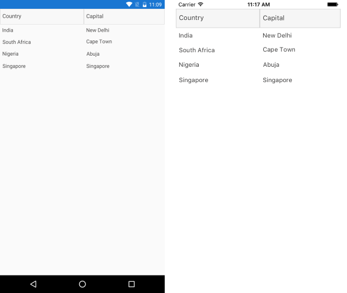

# Getting Started

This guide provides the information you need to start using the Telerik UI for .NET MAUI Barcode by adding the control to your project.

At the end, you will be able to achieve the following result.

....

## Prerequisites

Before adding the DataGrid, you need to:

1. [Set up your .NET MAUI application](#set-up-your-net-maui-application).

1. [Download Telerik UI for .NET MAUI](#download-telerik-ui-for-net-maui).

1. [Install Telerik UI for .NET MAUI](#install-telerik-ui-for-net-maui).

## Define the Control

1. When your .NET MAUI application is set up, you are ready to add a DataGrid control to your page.

 ```XAML
<telerikDataGrid:RadDataGrid x:Name="dataGrid"/>
 ```

1. Add the following namespace:

 ```XAML
xmlns:telerikDataGrid="clr-namespace:Telerik.XamarinForms.DataGrid;assembly=Telerik.Maui.Controls.Compatibility"
 ```


```C#
using Telerik.Maui.Controls.Compatibility;

public void Configure(IAppHostBuilder appBuilder)
{
	appBuilder		
		.UseTelerik()
		.UseMauiApp<App>();

}
```  

> RadDataGrid control provides UI virtualization, so it requires its visual parent to provide vertical or horizontal space for the control to fill into. The following scenarios will measure the control with infinity and the virtualization will not work:
>	* positioning the DataGrid control inside StackLayout which is wrapped in ScrollView.
>	* positioning the DataGrid inside ScrollView.

Now that you have added the control to your view, you need to make sure that is properly loaded with the required data.

By default, the **RadDataGrid** control will autogenerate rows depending on the number of objects in the collection set as its **ItemsSource**. For the purpose of this article, we are going to use the following simple business objects:

```C#
public class Data
{
	public string Country { get; set; }
	public string Capital { get; set; }
}
```

After you have created your collection of custom objects, you should assign it to the **ItemsSource** property of the control:

```C#
this.dataGrid.ItemsSource = new List<Data>
{
	new Data { Country = "India", Capital = "New Delhi"},
	new Data { Country = "South Africa", Capital = "Cape Town"},
	new Data { Country = "Nigeria", Capital = "Abuja" },
	new Data { Country = "Singapore", Capital = "Singapore" }
};
```

Here is the result:



## See Also

- [Columns]()
- [Grouping]()
- [Sorting]()
