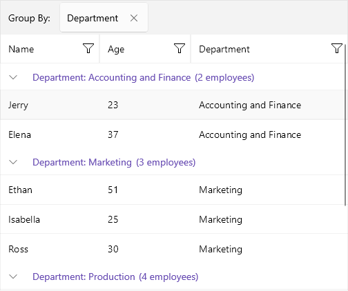

# Group Header Template for .NET MAUI DataGrid

The [.NET MAUI DataGrid]() features fully customizable group headers that allow you to tweak the appearance and behavior of the headers used to group data within the grid. You can achieve this customization by using the `GroupHeaderTemplate` property of the DataGrid, which allows you to set a custom `DataTemplate` to the group headers.

The BindingContext of the `GroupHeaderTemplate` is a `GroupHeaderContext` object and it includes the following properties:

* `Descriptor`: Specifies the descriptor used for the grouping.
* `Group`: Gets details on the group such as:
    * `Items`: Gets the child items of the group.
    * `Key`: Gets the key specific for the group.
* `IsExpanded`: Defines a value indicating whether the group is currently expanded (has its child items visible).
* `Level`: Gets the zero-based level (or the depth) of the group.

The following example demonstrates how to apply a sample `GroupHeaderTemplate` to the DataGrid:

**1.** Add the DataGrid definition to the page with a sample `GroupHeaderTemplate`:

<snippet id='datagrid-groupheader-template-xaml' />

**2.** Add the `ViewModel` class:

<snippet id='datagrid-grouping-viewmodel' />

**3.** Add the data item used for binding the DataGrid:

<snippet id='datagrid-grouping-object' />

**4.** Set the binding context of the DataGrid to the `ViewModel` class:

<snippet id='datagrid-grouping-propertygroupdescriptor-setvm' />

Check the result at the image below:

## See Also

- [Grouping UI]()
- [Property Group Descriptor]()
- [Delegate Group Descriptor]()
