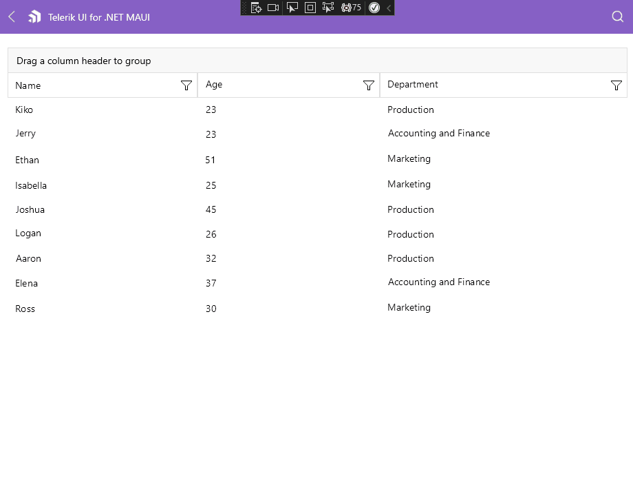

# .NET MAUI DataGrid Grouping

**Telerik UI for .NET MAUI DataGrid** supports grouping operations either through the UI - using the Grouping UI or programmatically through Property and Delegate group descriptors.

## Grouping UI



The DataGrid Grouping UI is enabled by design on desktop and disabled on mobile, it allows the user to group the DataGrid by dragging and dropping the column headers to the `DataGridGroupingPanel`. 

The UI is represented by the `DataGridGroupingPanel`. The panel is part of the DataGrid and it's visualized at the top.

> For more information about Grouping UI review the [Grouping UI]() article of the DataGrid.

## Programmatic Grouping

Programmatic grouping can be done by adding descriptors to the `GroupDescriptors` collection. There are two types of descriptors:

* `PropertyGroupDescriptor`&mdash;Uses a property from the model as a group key.
* `DelegateGroupDescriptor`&mdash;Creates a custom group key which you can use.

## Expand and Collapse Groups

The DataGrid supports group expand and collapse operations either through the UI by tapping on the group headers, or programmatically. By default, all the groups are expanded.

## Group Footer

The DataGrid has a support for group footers. You can visualize the footers by setting the `ShowGroupFooters` to `True`. 

If you want to fully customize the group footers you can use the `GroupFooterTemplate`(`DataTemplate`) property.

**Defining the `GroupFooterTemplate`**

```XAML
<telerik:RadDataGrid.GroupFooterTemplate>
    <DataTemplate>
        <Label Text="RandomText" TextColor="Crimson"/>
    </DataTemplate>
</telerik:RadDataGrid.GroupFooterTemplate>
```

> `GroupFooterTemplate` overrides the aggregates of the footer.

>tip For an outline of all DataGrid features review the [.NET MAUI DataGrid Overview]() article.

## See Also

- [Grouping UI]()
- [Property Group Descriptor]()
- [Delegate Group Descriptor]()