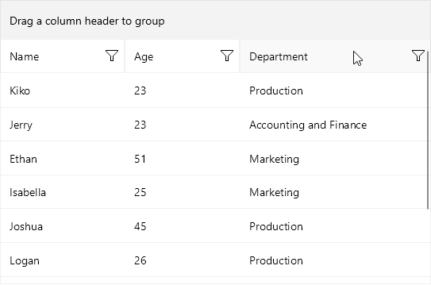

# .NET MAUI DataGrid Grouping

The [Telerik UI for .NET MAUI DataGrid]() supports grouping operations either through the UI - using the Grouping UI or programmatically through Property and Delegate group descriptors.

## Grouping UI

The DataGrid Grouping UI is enabled by design on desktop and disabled on mobile, it allows the user to group the DataGrid by dragging and dropping the column headers to the `DataGridGroupingPanel`. 

The UI is represented by the `DataGridGroupingPanel`. The panel is part of the DataGrid and it's visualized at the top.

**Grouping UI in the .NET MAUI DataGrid**

> For more information about Grouping UI review the [Grouping UI]() article of the DataGrid.

Customize the appearance of the items inside the grouping panel by using the `GroupingPanelItemTemplate` (`DataTemplate`) property.

## Programmatic Grouping

Programmatic grouping can be done by adding descriptors to the `GroupDescriptors` collection. There are two types of descriptors:

* `PropertyGroupDescriptor`&mdash;Uses a property from the model as a group key.
* `DelegateGroupDescriptor`&mdash;Creates a custom group key which you can use.

## Expand and Collapse Groups

The [Telerik UI for .NET MAUI DataGrid]() lets you expand and collapse a group either through the UI&mdash;by tapping on the group headers&mdash;or programmatically. 

The DataGrid allows you to collapse all groups and newly added groups by setting the `AutoExpandGroups` (`bool`) property. The default value of the `AutoExpandGroups` property is `true`, which means, all groups are expanded by default.

## Group Headers Customization

The DataGrid provides the ability to fully customize its group headers in order to achieve the desired look when the data is grouped. Go to [Group Header Template]() topic for detailed information on this.

>tip For an outline of all DataGrid features review the [.NET MAUI DataGrid Overview]() article.

## See Also

- [Grouping UI]()
- [Property Group Descriptor]()
- [Delegate Group Descriptor]()
- [Group Header Template]()
- [Group Header Styling]()
