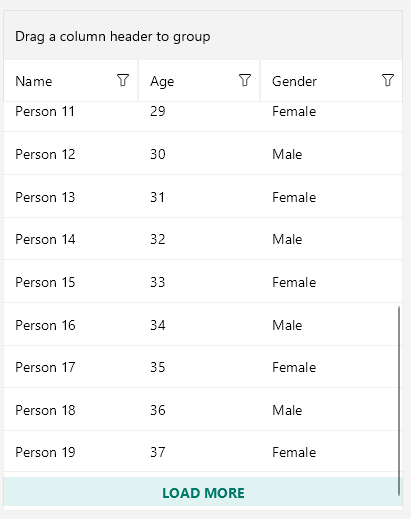
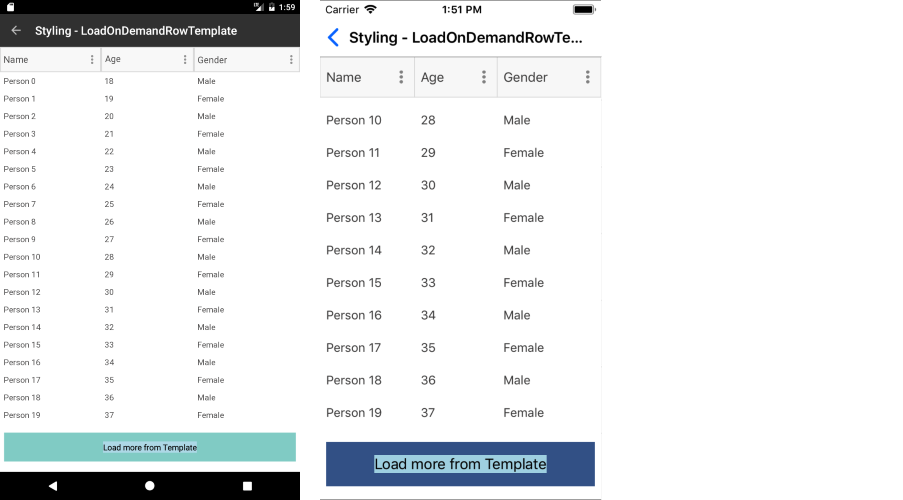

# .NET MAUI DataGrid Load On Demand

The  [Telerik UI for .NET MAUI DataGrid]() enables you to improve its performance and save computing resources, by loading data in the `RadDataGrid` when the control is already displayed.

To load a large data set on mobile devices, you can use incremental data loading at the time when the user required the items to be visualized.

## Modes

The DataGrid provides the following data-loading modes, which are present in the `LoadOnDemandMode` enumeration:

* `Automatic`&mdash;The load-on-demand mechanism is activated when you scroll down near the last item present in the viewport.

  >important To control when the items will start loading, set the `LoadOnDemandBufferItemsCount` property. It indicates at which point the additional items will start loading. For example, setting it to `20` will cause the new items to be loaded when you have scrolled the DataGrid, so that only 20 of the originally loaded items are left below.

* `Manual`&mdash;A **Load More** button is present at the bottom of the DataGrid. Clicking it will load additional items based on the approach you have chosen for loading the items (through the event, the command, or the collection).

>tip When the `LoadOnDemandMode` is `Automatic` and grouping applies to the control, the `LoadOnDemandMode` transforms to `Manual`.

## Approaches

The DataGrid supports the following options for using its load-on-demand feature, depending on your application requirements:

 * [Using the `LoadOnDemand` collection](#loadondemand-collection)
 * [Using the `LoadOnDemand` event](#loadondemand-event)
 * [Using the `LoadMoreData` command](#loadmoredata-command)

### LoadOnDemand Collection

To use this approach, you have to feed the `RadDataGrid` with a collection of type `LoadOnDemandCollection`. `LoadOnDemandCollection` is a generic type, so you need to point the type of objects it will contain. The type extends the `ObservableCollection<T>` class and expects a `Func<CancellationToken, IEnumerable>` in the constructor.

The following example demonstrates a simple setup that shows how to use the collection:

<snippet id='datagrid-loadondemand-collection-csharp'/>

In the example, the `Items` property is declared as follows:

<snippet id='datagrid-loadondemand-collection-property-csharp'/>

### LoadOnDemand Event

You can load new items by utilizing the `LoadOnDemand` event. The event uses `LoadOnDemandEventArgs` arguments through which you need to indicate when the data is loaded by setting the `IsDataLoaded`(`bool`) property.

<snippet id='datagrid-loadondemand-event-csharp'/>

### LoadMoreData Command

The `LoadMoreData` command is another alternative which you can use and which is suitable for MVVM scenarios.

The following example demonstrates how to create the command.

<snippet id='datagrid-customloadmoredatacommand-csharp'/>

Eventually, you need to add this custom command to the `Commands` collection of the DataGrid.

<snippet id='datagrid-customloadmoredatacommand-addtocollection-csharp'/>

>important Invoking the `ShowLoadOnDemandLoadingIndicator` and `HideLoadOnDemandLoadingIndicators` is a notable part as without calling these methods, the `BusyIndicator` used for the functionality will not be visualized.

## Styling

Besides the different approaches for loading the data, the DataGrid exposes several mechanisms related to the styling of the functionality which you can use according to the approach you have chosen.

### Load-More-Button Row

The `LoadOnDemandRowStyle` property can be used to style the appearance of the row that contains the **Load More** button when the `LoadOnDemandMode` is `Manual`.

The custom style is of type `Style` with target type `DataGridLoadOnDemandRowAppearance`:

<snippet id='datagrid-loadondemandrowstyle-xaml'/>

You have to set it to the `LoadOnDemandRowStyle` property of the DataGrid:

<snippet id='datagrid-setting-loadondemandrowstyle-xaml'/>

>caption Row appearance after setting the `LoadOnDemandRowStyle` property

### Load-More-Button Row Template

The `LoadOnDemandRowTemplate` property can be used to set the template of the row that contains the **Load More** button when the `LoadOnDemandMode` is `Manual`.

The following example demonstrates a custom `DataTemplate`:

<snippet id='datagrid-loadondemandrowtemplate-xaml'/>

The following example shows how to set the property:

<snippet id='datagrid-setting-loadondemandrowtemplate-xaml'/>

>caption Row appearance after setting the `LoadOnDemandRowTemplate`

## Additional Resources
- [.NET MAUI DataGrid Product Page](https://www.telerik.com/maui-ui/datagrid)
- [.NET MAUI DataGrid Forum Page](https://www.telerik.com/forums/maui?tagId=1801)
- [Telerik .NET MAUI Blogs](https://www.telerik.com/blogs/mobile-net-maui)
- [Telerik .NET MAUI Roadmap](https://www.telerik.com/support/whats-new/maui-ui/roadmap)

## See Also

- [Grouping in the Telerik UI for .NET MAUI DataGrid]()
- [Sorting .NET MAUI DataGrid Records]()
- [Filtering .NET MAUI DataGrid Records]()
