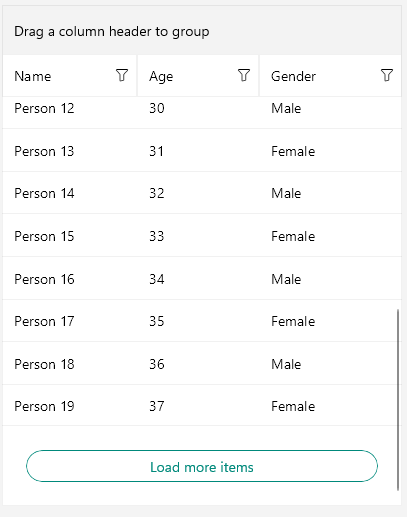

# Load On Demand

In specific cases you may need to load data in the `RadDataGrid` when the control is already displayed as this can improve the performance and save computing resources. Loading a large data set on a mobile device has its challenges. One of the most popular approaches is using incremental data loading the moment the items need to be visualized.

## Modes

The DataGrid offers two loading modes which are present in the `LoadOnDemandMode` enumeration:

* `Automatic`&mdash;The load-on-demand mechanism is activated when you scroll down near the last item present in the view port.

  >important You can control when the items will start loading more precisely by setting the `LoadOnDemandBufferItemsCount` property. It indicates at what point the additional items will start loading. For example, setting it to `20` will cause the new items to be loaded when you have scrolled the DataGrid, so that only 20 of the originally loaded items are left below.

* `Manual`&mdash;A **Load More** button is present at the bottom of the DataGrid. Clicking it will load additional items based on the approach you have chosen for loading the items (through the event, the command, or the collection).

## Approaches

The DataGrid supports three different options for using its load-on-demand feature. You can choose the most convenient for you based on your application requirements:

 * [Using the LoadOnDemand collection](#loadondemandcollection)
 * [Using the LoadOnDemand event](#loadondemand-event)
 * [Using the LoadMoreData command](#loadmoredata-command)

### LoadOnDemandCollection

To use this approach, you have to feed the `RadDataGrid` with a collection of type `LoadOnDemandCollection`. It is a generic type, so you need to point the type of objects it will contain. It extends the `ObservableCollection<T>` class and expects a `Func<CancellationToken, IEnumerable>` in the constructor.

The following example demonstrates a simple setup that shows how to use the collection:

<snippet id='datagrid-loadondemand-collection-csharp'/>

In the example, the `Items` property is declared as follows:

<snippet id='datagrid-loadondemand-collection-property-csharp'/>

### LoadOnDemand Event

You can load new items by utilizing the `LoadOnDemand` event. It uses `LoadOnDemandEventArgs` arguments through which you need to indicate when the data is loaded using the `IsDataLoaded`(`bool`) property.

<snippet id='datagrid-loadondemand-event-csharp'/>

### LoadMoreData Command

The `LoadMoreData` command is another alternative which you can use and which is suitable for MVVM scenarios.

The following example demonstrates how to create the command.

<snippet id='datagrid-customloadmoredatacommand-csharp'/>

Eventually, you need to add this custom command to the `Commands` collection of the DataGrid.

<snippet id='datagrid-customloadmoredatacommand-addtocollection-csharp'/>

>important Invoking the `ShowLoadOnDemandLoadingIndicator` and `HideLoadOnDemandLoadingIndicators` is a notable part as without calling these methods, the BusyIndicator used for the functionality will not be visualized.

## Styling

Besides the different approaches for loading the data, `RadDataGrid` exposes several mechanisms related to the styling of the functionality which you can use according to the approach you have chosen.

### LoadOnDemandRowStyle

The `LoadOnDemandRowStyle` property can be used to style the appearance of the row that contains the **Load More** button when the `LoadOnDemandMode` is `Manual`.

The custom style is of type `DataGridLoadOnDemandRowStyle`:

<snippet id='datagrid-loadondemandrowstyle-xaml'/>

You have to set it to the `LoadOnDemandRowStyle` property of the DataGrid:

<snippet id='datagrid-setting-loadondemandrowstyle-xaml'/>

**Row Appearance after Setting the LoadOnDemandRowStyle**

### LoadOnDemandRowTemplate

The `LoadOnDemandRowTemplate` property can be used to set the template of the row that contains the **Load More** button when the `LoadOnDemandMode` is `Manual`.

The following example demonstrates a custom `DataTemplate`:

<snippet id='datagrid-loadondemandrowtemplate-xaml'/>

The following example shows how to set the property:

<snippet id='datagrid-setting-loadondemandrowtemplate-xaml'/>

**Row Appearance after Setting the LoadOnDemandRowTemplate**

## See Also

* [DataGrid Grouping]()
* [DataGrid Sorting]()
