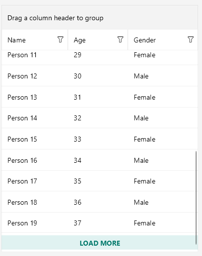
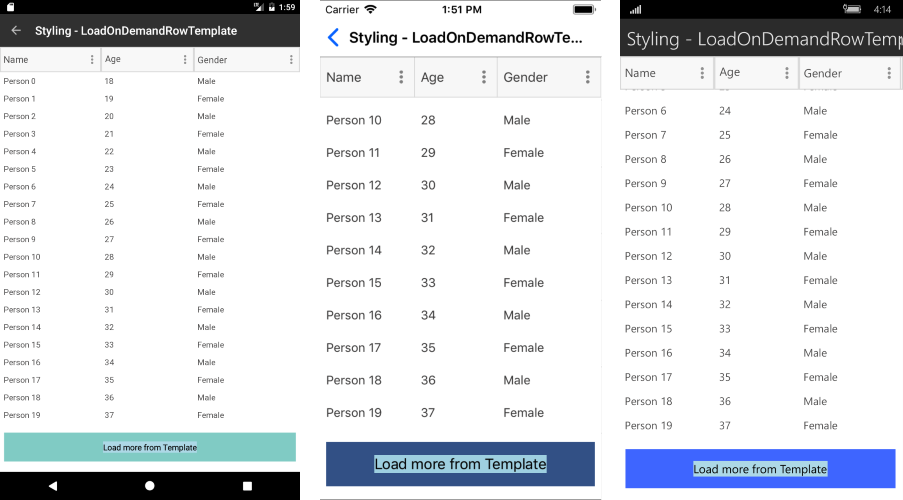

# .NET MAUI DataGrid Load On Demand Styling

The DataGrid exposes several mechanisms for styling the load-on-demand functionality, which you can use according to the `LoadOnDemandMode` you have chosen.

## Style the Loading Indicator in Automatic Mode

A loading indicator is visualized when data is loaded on demand automatically. The indicator is a [`RadBusyIndicator`](), so to style its appearance, use an implicit style with `TargetType` set to `telerik:RadBusyIndicator`:

```XAML
<Style TargetType="telerik:RadBusyIndicator">
    <Setter Property="AnimationContentWidthRequest" Value="80" />
    <Setter Property="AnimationContentHeightRequest" Value="100" />
    <Setter Property="AnimationContentColor" Value="LightBlue" />
    <Setter Property="AnimationType" Value="Animation5" />
    <Setter Property="BackgroundColor" Value="LightCoral" />
</Style>
```

## Style the LoadMore Row in Manual Mode

Use the `LoadOnDemandRowStyle` property to style the appearance of the row that contains the **Load More** button when the `LoadOnDemandMode` is `Manual`.

The custom style is of type `Style` with target type `DataGridLoadOnDemandRowAppearance`:

<snippet id='datagrid-loadondemandrowstyle-xaml'/>

Set the style to the `LoadOnDemandRowStyle` property of the DataGrid:

<snippet id='datagrid-setting-loadondemandrowstyle-xaml'/>

The following image shows the row appearance after setting the `LoadOnDemandRowStyle` property:



## Customize the LoadMore RowTemplate in Manual Mode

Use the `LoadOnDemandRowTemplate` property to set the template of the row that contains the **Load More** button when the `LoadOnDemandMode` is `Manual`.

The following example demonstrates a custom `DataTemplate`:

<snippet id='datagrid-loadondemandrowtemplate-xaml'/>

The following example shows how to set the property:

<snippet id='datagrid-setting-loadondemandrowtemplate-xaml'/>

The following image shows the row appearance after setting the `LoadOnDemandRowTemplate` property:



## See Also

- [Load On Demand Overview]()
- [Load On Demand Collection]()
- [Load On Demand Event]()
- [Load On Demand Command]()
