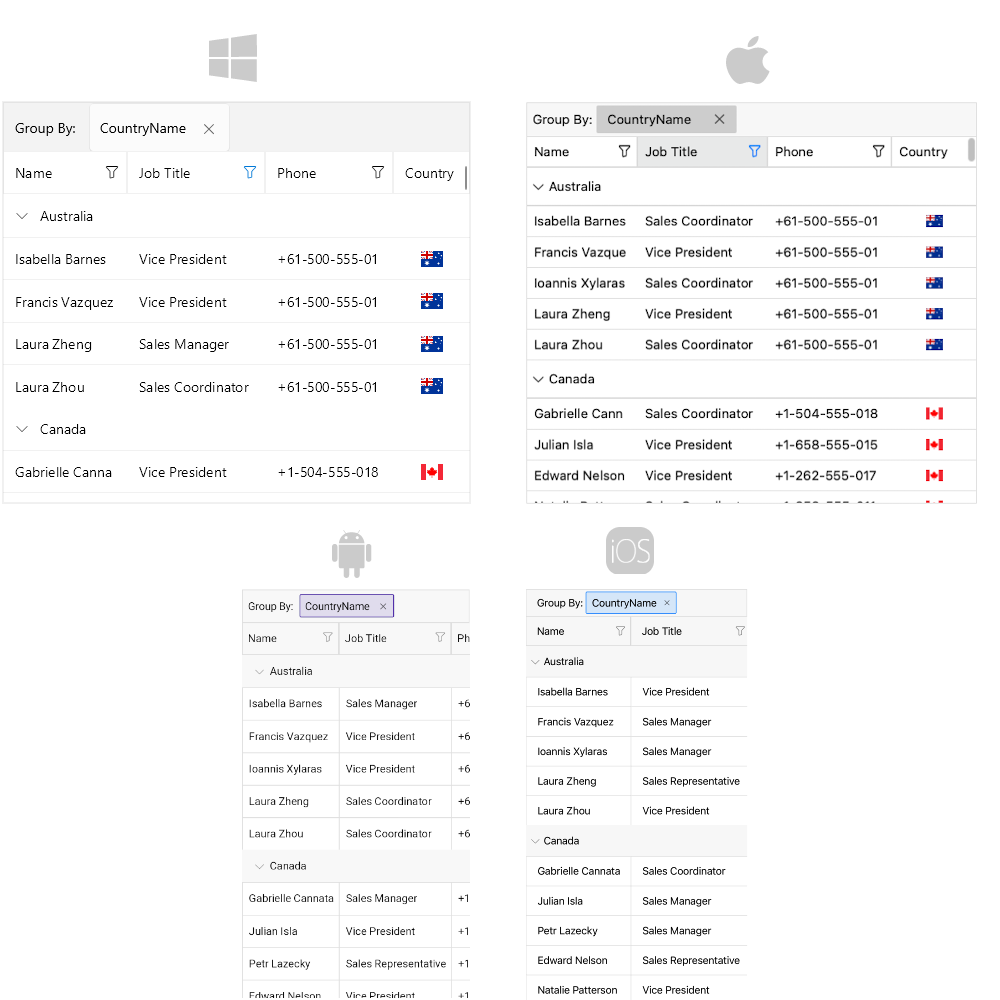

# .NET MAUI DataGrid Overview

The Telerik UI for .NET MAUI DataGrid is a powerful control that allows you to visualize and edit tabular represented data in your .NET MAUI applications.

Most of the data on the Internet is stored in tables within a database. The Telerik UI for .NET MAUI DataGrid provides the same abstraction over the data&mdash;It has columns and rows, and the intersection of a row and a column is called a cell.

When the data from a database is sent to the client, usually converted to a Business object (or the so-called `ViewModel`) where each instance represents a table row and each property of the object represents a column within the original table. The DataGrid also supports alternating row colors so that your users can distinguish one row from another.

The optimized data layer of the DataGrid enables fast grouping, sorting, and filtering operations. The user interface uses virtualization for its row and cell elements, which means that visual elements are created only when needed and only for the currently visible cells.

## MAUI DataGrid Video Tutorial

If you prefer video instructions, watch this short MAUI DataGrid video tutorial. It covers to following topics:
* Introduction to Telerik MAUI DataGrid and its features.
* Setup the DataGrid in a .NET MAUI app.
* Configure the columns and use custom templates.
* Use sorting, filtering and selection features.

<iframe width="560" height="315" src="https://www.youtube.com/embed/XxUvA4fKHzU?si=EuqJC2OIPrIDMaGd" title="Mastering the DataGrid in Telerik UI for .NET MAUI: Setup, Columns, Sorting, and More" frameborder="0" allow="accelerometer; autoplay; clipboard-write; encrypted-media; gyroscope; picture-in-picture; web-share" referrerpolicy="strict-origin-when-cross-origin" allowfullscreen></iframe>

## Built-in Columns

The MAUI DataGrid provides a set of [built-in columns]() such as Text, Boolean, Numeric, ComboBox, Date, Time, and Template. These predefined templates allow you to handle different data types and user scenarios, each with its specific editor.

## Reorder and Resize Columns

The .NET MAUI DataGrid provides a number of features and configuration options related to its columns to provide a flexible and usable user experience. For example, you can enable [column reordering]() and [resizing](). If you want to prevent a column to resize, you can [lock the column]() and keep the important information always on top.

## Sort, Filter and Group Data

Perform SORT, FILTER, and GROUP operations on your data by using the convenient API of the control. Apply the [sorting](), [filtering](), and [grouping]() operations per column.

## Editing

You can enable users to [edit]() the data presented in the .NET MAUI DataGrid. Depending on the column data type, a relevant editor allows end users to edit content in a friendly environment. For example, if one of the columns is a date, a date-picker will be used to offer a change in the date field.

## Single and Multiple Selection

The DataGrid features a [single or a multiple-item selection]() and provides options for controlling the cell or row selection unit, thus enabling any selection scenario you want your MAUI application users to have.

## Load Data On Demand

In some cases, you may need to [load data in the .NET MAUI DataGrid when the control is already displayed]() as this can improve the performance of your application. The DataGrid offers automatic data loading once the user scrolls to the last available record, or by displaying a customizable button which will initiate the loading of more data items.

## Row Details

The MAUI DataGrid allows you to represent additional information for the data in the row by using the [row details]() feature.

## Aggregates Support

You can use the exposed API for applying [aggregates functions](). You can use the predefined aggregates functions like `Sum`, `Count`, `Min`, `Max`, `Average`, etc, or implement a custom function. 

## Search As You Type

The DataGrid provides the ability to search for specific data within its `ItemsSource` by using its [built-in search functionality]().

## Paging Support

You can [page the data]() of the DataGrid using the Telerik UI for .NET MAUI [DataPager]() control.

## Keyboard Navigation Support

Use keyboard keys for navigation in the MAUI DataGrid control. This feature is available on WinUI and MacCatalyst.

## Row Height

By default, the row height is calculated according to the cell content. You can override this behavior by setting a [height for the rows](). 

## Column Footer

The Telerik UI for .NET MAUI DataGrid allows you to display additional information which applies to the columns in a specific row placed at the bottom of the control. This row consists of individual [footer cells]() for each column.

## Empty Template

When the .NET MAUI DataGrid does not have any data (`ItemsSource` is null or the collection is empty), an [empty template]() is displayed in the DataGrid.

## Commands

The MAUI DataGrid allows you to add [commands]() to the commands collection, in case you want to execute an additional logic when certain actions occur. You can execute the commands when cell is tapped, double tapped, begins the editing operation, when tapping on the column header, filter the data and more. 

## Theming and Style

You can apply a [theme]() to the MAUI DataGrid. If you prefer to use your own styling, then you can use the [flexible styling API]() of the .NET MAUI DataGrid. The styling API allows you to style the DataGrid rows and columns, the cell content inside the columns, the group header, the aggregates inside the group header and the group footer, etc. 
In addition, you can apply a style selector.

## Localization

The Telerik UI for .NET MAUI DataGrid provides [localization support](#localization). You can translate the text displayed in the Filtering UI, Grouping panel, etc. to other languages, so that your application can be adapted to different cultures.

## Next Steps

- [Getting Started with Telerik UI for .NET MAUI DataGrid]()

## See Also

- [.NET MAUI DataGrid Product Page](https://www.telerik.com/maui-ui/datagrid)
- [.NET MAUI DataGrid Forum Page](https://www.telerik.com/forums/maui?tagId=1801)
- [Telerik .NET MAUI Blogs](https://www.telerik.com/blogs/mobile-net-maui)
- [Telerik .NET MAUI Roadmap](https://www.telerik.com/support/whats-new/maui-ui/roadmap)
