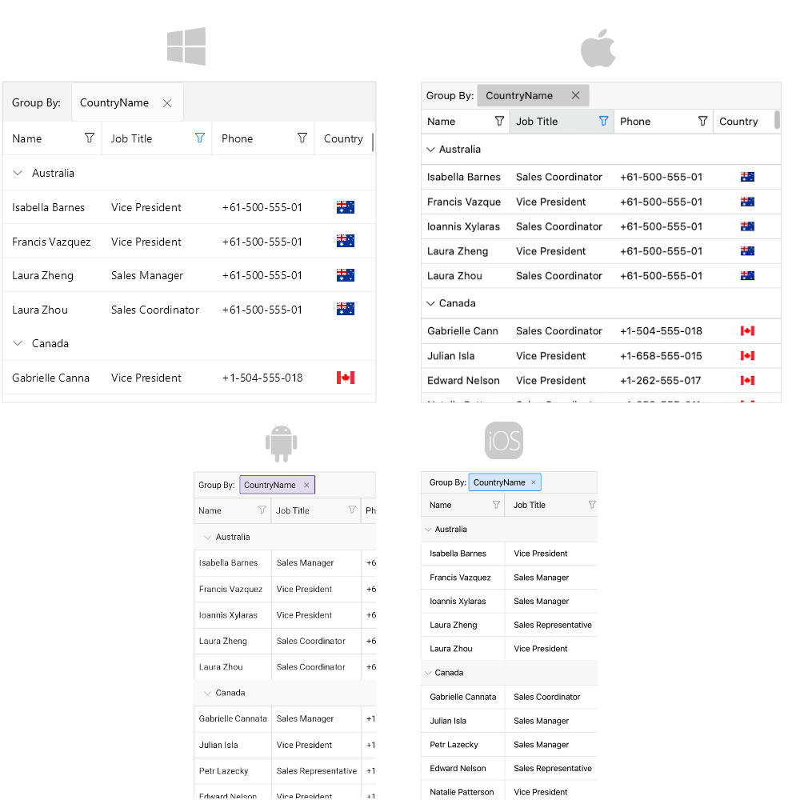

# .NET MAUI DataGrid Overview

The Telerik UI for [.NET MAUI DataGrid](https://www.telerik.com/maui-ui/datagrid) displays, edits, and organizes tabular data in .NET MAUI applications. Use it when you need a flexible grid that can handle large data sets, support common data operations, and adapt to desktop and mobile layouts.

The DataGrid uses rows, columns, and cells to represent business data in a familiar layout. It also uses UI virtualization so that row and cell visuals are created only when they are needed, which helps keep scrolling and interaction responsive.

Use the .NET MAUI DataGrid to:

* Display data from collections of business objects or `ViewModel` instances.
* Configure columns for different data types and editing scenarios.
* Let users sort, filter, group, search, and page through data.
* Improve usability with selection, row details, aggregates, and keyboard navigation.
* Customize styling, localization, empty states, and command handling.

The following image shows the DataGrid running on supported desktop and mobile platforms:

## MAUI DataGrid Video Tutorial

If you prefer a guided walkthrough, watch the MAUI DataGrid video tutorial.

<iframe width="560" height="315" src="https://www.youtube.com/embed/XxUvA4fKHzU" title="Take your .NET MAUI skills to the next level with Chapter 4 of the Telerik UI for .NET MAUI course! This video provides a comprehensive guide to .NET MAUI Grid control. Learn about its features, setup process, column configuration, and creating custom column templates. Discover how to enable sorting, filtering, and selection for a dynamic and powerful data presentation in your apps. Watch now and become a DataGrid expert!" frameborder="0" allow="accelerometer; autoplay; clipboard-write; encrypted-media; gyroscope; picture-in-picture; web-share" referrerpolicy="strict-origin-when-cross-origin" allowfullscreen></iframe>

## Built-in Columns

The MAUI DataGrid provides a set of [built-in columns]() such as Text, Boolean, Numeric, ComboBox, Date, Time, and Template. These predefined templates allow you to handle different data types and user scenarios, each with its specific editor.

## Reordering and Resizing Columns

The .NET MAUI DataGrid provides a number of features and configuration options related to its columns to provide a flexible and usable user experience. For example, you can enable [column reordering]() and [resizing](). If you want to prevent a column from resizing, you can [lock the column]() and keep the important information always on top.

## Sorting, Filtering, and Grouping Data

Perform sorting, filtering, and grouping operations on your data by using the convenient API of the control. Apply the [sorting](), [filtering](), and [grouping]() operations per column. You can sort, filter and group through the built-in UI or programmatically using the exposed descriptors.

## Editing

You can enable users to [edit]() the data presented in the .NET MAUI DataGrid. Depending on the column data type, a relevant editor allows end users to edit content in a friendly environment. For example, if one of the columns is a date, a date-picker will be used to offer a change in the date field.

## Single and Multiple Selection

The DataGrid features a [single or a multiple-item selection]() and provides options for controlling the cell or row selection unit, thus enabling any selection scenario you want your MAUI application users to have.

## Loading Data On Demand

In some cases, you may need to [load data in the .NET MAUI DataGrid when the control is already displayed]() as this can improve the performance of your application. The DataGrid offers automatic data loading once the user scrolls to the last available record, or by displaying a customizable button which will initiate the loading of more data items.

## Row Details

The MAUI DataGrid allows you to represent additional information for the data in the row by using the [row details]() feature.

## Aggregates Support

You can use the exposed API for applying [aggregates functions](). You can use the predefined aggregates functions like `Sum`, `Count`, `Min`, `Max`, `Average`, etc, or implement a custom function. 

## Searching As You Type

The DataGrid provides the ability to search for specific data within its `ItemsSource` by using its [built-in search functionality]().

## Paging Support

You can [page the data]() of the DataGrid using the Telerik UI for .NET MAUI [DataPager]() control.

## Keyboard Navigation Support

Use keyboard keys for navigation in the MAUI DataGrid control. This feature is available on [WinUI]() and [MacCatalyst]().

## Row Height

By default, the row height is calculated according to the cell content. You can override this behavior by setting a [height for the rows](). 

## Column Headers Visibility

The DataGrid exposes the `ShowColumnHeaders` (`bool`) property which controls whether the column headers row is visible. The default value is true. Set it to `False` to remove the column headers row from the DataGrid. For more details, refer to the [Defining Columns](#column-headers) article.

## Column Footer

The Telerik UI for .NET MAUI DataGrid allows you to display additional information which applies to the columns in a specific row placed at the bottom of the control. This row consists of individual [footer cells]() for each column.

## Empty Template

When the .NET MAUI DataGrid does not have any data (`ItemsSource` is null or the collection is empty), an [empty template]() is displayed in the DataGrid.

## Commands

The MAUI DataGrid allows you to add [commands]() to the commands collection to execute additional logic when certain actions occur. You can execute the commands when a cell is tapped, double-tapped, when an editing operation begins, when tapping on a column header, when filtering data, and more. 

## Data Refresh and Busy State

The DataGrid also exposes APIs that help you control how data changes are processed:

* `ApplyDataOperationsOnPropertyChange` (`bool`)&mdash;Defines whether sorting, filtering, and grouping are reapplied when an item in the `ItemsSource` raises `PropertyChanged`. The default value is `True`.
* `IsBusy` (`bool`)&mdash;Indicates whether the DataGrid is currently busy. Set this property when you want to display an application-defined loading state while data is being fetched or updated.

When you bind the DataGrid to models with nested properties, you can also enable `ListenForNestedPropertyChange` to react to changes coming from nested objects. For more details, see [Nested Properties]().

## Theming and Style

You can apply a [theme]() to the MAUI DataGrid. If you prefer to use your own styling, then you can use the [flexible styling API]() of the .NET MAUI DataGrid. The styling API allows you to style the DataGrid rows and columns, the cell content inside the columns, the group header, the aggregates inside the group header and the group footer, etc. 
In addition, you can apply a style selector.

## Localization

The Telerik UI for .NET MAUI DataGrid provides [localization support](#localization). You can translate the text displayed in the Filtering UI, Grouping panel, etc. to other languages, so that your application can be adapted to different cultures.

## Next Steps

Continue with these articles to start using and refining the DataGrid:

- [Getting Started with Telerik UI for .NET MAUI DataGrid]()
- [Configure DataGrid column types and templates]()
- [Customize the DataGrid appearance with styling]()

## See Also

- [.NET MAUI DataGrid Product Page](https://www.telerik.com/maui-ui/datagrid)
- [.NET MAUI DataGrid Forum Page](https://www.telerik.com/forums/maui?tagId=1801)
- [Telerik .NET MAUI Blogs](https://www.telerik.com/blogs/mobile-net-maui)
- [Telerik .NET MAUI Roadmap](https://www.telerik.com/support/whats-new/maui-ui/roadmap)

<VideoMetadata 
    name="Mastering the DataGrid in Telerik UI for .NET MAUI: Setup, Columns, Sorting, and More | Chapter 4"
    description="Take your .NET MAUI skills to the next level with Chapter 4 of the Telerik UI for .NET MAUI course! This video provides a comprehensive guide to .NET MAUI Grid control. Learn about its features, setup process, column configuration, and creating custom column templates. Discover how to enable sorting, filtering, and selection for a dynamic and powerful data presentation in your apps. Watch now and become a DataGrid expert!"
    thumbnail-url="https://img.youtube.com/vi/XxUvA4fKHzU/maxresdefault.jpg"
    upload-date="2024-12-05T00:00:00Z"
    duration="PT20M27S"
    content-url="https://youtu.be/XxUvA4fKHzU"
    embed-url="https://www.youtube.com/embed/XxUvA4fKHzU">
</VideoMetadata>