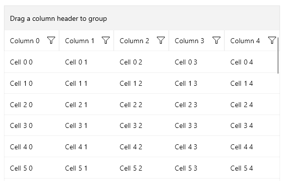
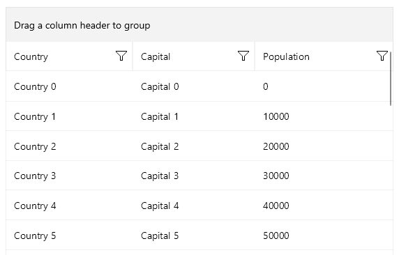

# .NET MAUI DataGrid Data Binding: Binding to Dynamic Data

As of Telerik UI for .NET MAUI 6.8.0, the DataGrid supports binding to any type that implements the standard `IDynamicMetaObjectProvider` DLR interface, such as `DynamicObject` and `ExpandoObject`.

Using Dynamic Data enables you to filter, group, and sort the data inside the DataGrid both through the UI and programmatically.

## Executing Dynamic Data on iOS and MacCatalyst

When you develop applications for Apple devices and plan to bind the DataGrid to dynamic data, you must consider the <a href = "https://learn.microsoft.com/en-us/dotnet/maui/macios/interpreter?view=net-maui-8.0&source=recommendations" target="_blank">security restrictions set by Apple</a>. These restrictions disallow the execution of dynamically generated code on a device. As a result, apps that use `DynamicObject` or `ExpandoObject` will crash in a release build for iOS and Mac Catalyst with a `System.ExecutionEngineException`.
To prevent the exception, use the `MtouchInterpreter` <a href = "https://learn.microsoft.com/en-us/dotnet/maui/macios/interpreter?view=net-maui-8.0&source=recommendations#enable-the-interpreter" target="_blank"> as recommended by Microsoft</a>.

```xml
<PropertyGroup Condition="'$(Configuration)|$(RuntimeIdentifier)'=='Release|maccatalyst-arm64'">
	<MtouchInterpreter>-all,+Telerik.Maui.Controls.Compatibility.dll</MtouchInterpreter>
</PropertyGroup>
```

For more information about these limitations and the suggested solution, see Microsoft's <a href = "https://learn.microsoft.com/en-us/dotnet/maui/macios/interpreter?view=net-maui-8.0&source=recommendations" target="_blank">Mono interpreter on iOS and Mac Catalyst</a> article.

## Binding to DynamicObject

The following example shows how to implement a `DynamicObject` class with Dynamic Language Runtime (DLR) and Common Language Runtime (CLR) fields and bind it to the DataGrid. The standard CLR properties registered in the dynamic type must be exposed through the DLR API.

The model shows a class that derives from `DynamicObject` and contains a CLR property called `Id`. When the DataGrid auto-generates its columns, the `TryGetMember` method of the `DynamicObject` class will be used to fetch the values for each column. You must also implement a specific logic in the method to allow `RadDataGrid` to work with both CLR and DLR data.

**1.** Add the model for the DataGrid:

<snippet id='datagrid-dynamicobject-model' />

**2.** Define the `ViewModel`:

<snippet id='datagrid-dynamicobject-viewmodel' />

**3.** Define the `RadDataGrid`:

<snippet id='datagrid-dynamicobject' />

**4.** Add the `telerik` namespace:

```XAML
xmlns:telerik="http://schemas.telerik.com/2022/xaml/maui"
```

This is the result:



## Binding to ExpandoObject

**1.** Define the `RadDataGrid` control in XAML:

<snippet id='datagrid-expandoobject' />

**2.** Add the `telerik` namespace:

```XAML
xmlns:telerik="http://schemas.telerik.com/2022/xaml/maui"
```

**3.** Define the `ViewModel`:

<snippet id='datagrid-expandoobject-viewmodel' />

This is the result:



## Additional Resources

- [.NET MAUI DataGrid Product Page](https://www.telerik.com/maui-ui/datagrid)
- [.NET MAUI DataGrid Forum Page](https://www.telerik.com/forums/maui?tagId=1801)
- [Telerik .NET MAUI Blogs](https://www.telerik.com/blogs/mobile-net-maui)
- [Telerik .NET MAUI Roadmap](https://www.telerik.com/support/whats-new/maui-ui/roadmap)

## See Also

- [Filtering UI in the Telerik UI for .NET MAUI DataGrid]()
- [Programmatic Filtering in the DataGrid]()
- [Grouping in the DataGrid]()
- [Styling the Appearance of the DataGrid]()
