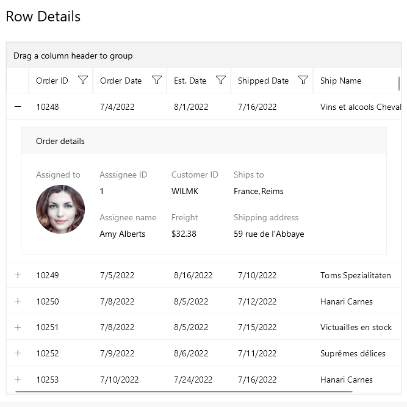

# .NET MAUI DataGrid Row Details Overview

The Telerik UI for .NET MAUI DataGrid control is capable of presenting additional information through the Row Details functionality. The Row Details is a Data Template defined on the grid or row level and is used for displaying data without affecting the dimensions of the row and the cells within it.

To show the Row Details, you can use the following exposed options:

- The default `DataGridToggleRowDetailsColumn` column &mdash;Allows showing and hiding the row details for an item. For additional information, refer to the DataGrid [Toggle Row Details Column]({% slug datagrid-columns-toggle-column% })

- The `SelectionChanged` event.

The DataGrid exposes the following properties that control the row details functionality:

* `AreNowDetailsFrozen` (type `bool`)&mdash;The property indicates whether the row details keep their position during horizontal scroll.

* `ExpandedRowDetails` (type `IList`)&mdash;Defines the collection of items that have expanded row details.

* `CanUserExpandMultipleRowDetails` (type `bool`)&mdash;The property indicates whether multiple row details can be expanded.

## Next Steps

- [Row Details Template]()

## See Also

- [.NET MAUI DataGrid Product Page](https://www.telerik.com/maui-ui/datagrid)
- [.NET MAUI DataGrid Forum Page](https://www.telerik.com/forums/maui?tagId=1801)
- [Telerik .NET MAUI Blogs](https://www.telerik.com/blogs/mobile-net-maui)
- [Telerik .NET MAUI Roadmap](https://www.telerik.com/support/whats-new/maui-ui/roadmap)
