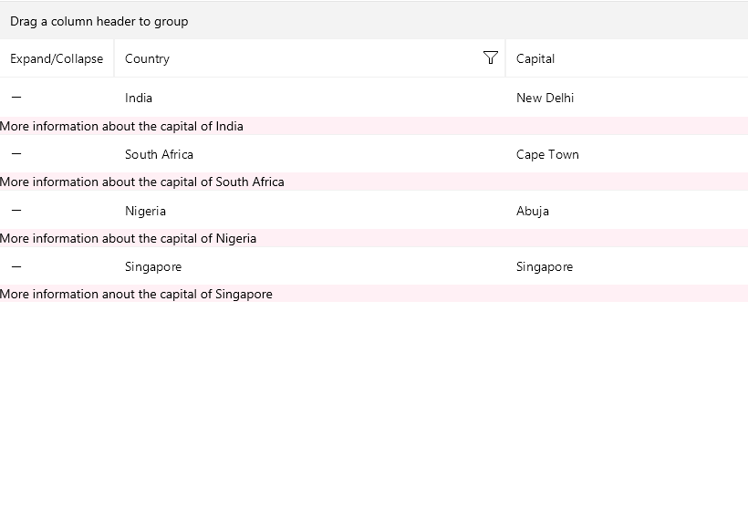

# .NET MAUI DataGrid Row Details Template

The Telerik UI for .NET MAUI DataGrid control defines a `RowDetailsTemplate` property (type `DataTemplate`). The property is used for displaying row details. 

The following example shows how to define the `RowDetailsTemplate` property in the DataGrid control.

1. Define the DataGrid in XAML:

<snippet id ='datagrid-rowdetails'/>

2. Define `RowDetailsTemplate` in XAML

<snippet id ='datagrid-rowdetails-template'/>

3. Define the Business Model:

<snippet id ='datagrid-business-model'/>

4. Define the ItemsSource:

<snippet id ='datagrid-items-source'/>

5. In addition, you can define the row details to be expanded:

<snippet id ='datagrid-expand-rowdetails'/>

The image below illustrates the result from the code snippets:

## See Also

 - [Row Details Overview]()
 - [DataGrid Overview]()
