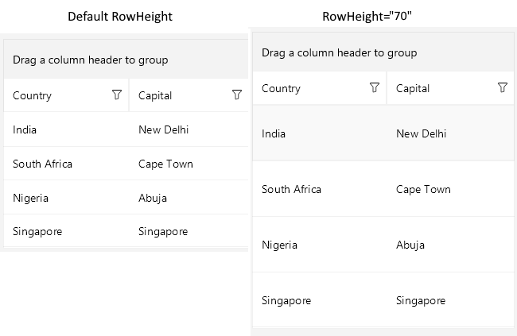

# .NET MAUI DataGrid Row Height

The Telerik UI for .NET MAUI DataGrid provides full control over the way the content is accommodated inside the DataGrid by enabling you to manually set the height of its rows.

By default, the row height is calculated according to the cell content.

For more information on customizing the row style, positioning the text inside the cells, setting the text margins, and defining the text alignment, see the topic about [customizing the content style of the .NET MAUI DataGrid cell](#cellcontentstyle).

To set the row height, apply the `RowHeight` property of type `double` to the DataGrid instance.

```XAML
<telerik:RadDataGrid x:Name="dataGrid"
							RowHeight="50"
							ItemsSource="{Binding Source}" />
```

The following image shows the difference in the way the DataGrid is rendered with and without `RowHeight` specifically set:



## Additional Resources

- [.NET MAUI DataGrid Product Page](https://www.telerik.com/maui-ui/datagrid)
- [.NET MAUI DataGrid Forum Page](https://www.telerik.com/forums/maui?tagId=1801)
- [Telerik .NET MAUI Blogs](https://www.telerik.com/blogs/mobile-net-maui)
- [Telerik .NET MAUI Roadmap](https://www.telerik.com/support/whats-new/maui-ui/roadmap)

## See Also

- [Setting the Telerik UI for .NET MAUI DataGrid Columns]()
- [Aggregating Data in the DataGrid]()
- [Sorting .NET MAUI DataGrid Records]()
- [Filtering .NET MAUI DataGrid Records]()


