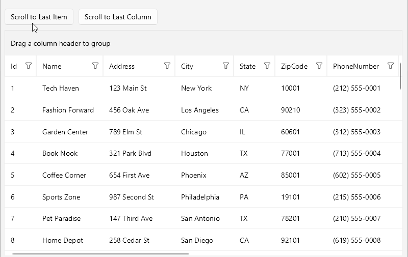
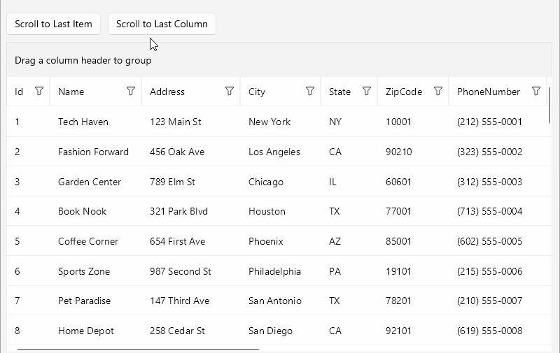

# .NET MAUI DataGrid Scrolling

The [Telerik UI for .NET MAUI DataGrid]() has an internal scrolling mechanism achieved by the supported vertical and horizontal scrollbars for scrolling through its data.

>important Avoid nesting the DataGrid in a ScrollView and other controls that provide scrolling.

## Scroll to Item

For implementing programmatic scrolling to a specific item, the DataGrid exposes the `ScrollItemIntoView(object item)` method, which brings the specified data item into view. Note that `ScrollItemIntoView` works in scenarios where the DataGrid Rows are with the same height. For more details, review the article on [setting the .NET MAUI DataGrid rows]().

The following example shows how to scroll to the last item of the DataGrid. The code executes on a button click.

1. Define the DataGrid in XAML:

<snippet id ='datagrid-scrolling'/>

1. Define the button, which will execute the scroll-to-item action:

<snippet id ='button-scrolling-to-item'/>

1. Add the `telerik` namespace:
 
`xmlns:telerik="http://schemas.telerik.com/2022/xaml/maui"`

1. 1. On button click, call the `ScrollItemIntoView` method:

<snippet id ='datagrid-scrolltoitem'/>

1. Define the data model:

<snippet id ='datagrid-scrolling-datamodel'/>

1. Define the `ViewModel`:

<snippet id ='datagrid-scrolling-viewmodel'/>

The following video shows the end result.

## Scroll to Column

For implementing programmatic scrolling to a specific column, the DataGrid exposes the `ScrollColumnIntoView(DataGridColumn column)` method, which brings the specified column into the visible viewport.
If the column is frozen or not part of the grid, no scrolling will occur. The scrolling operation adjusts the horizontal scroll position to make the column visible while maintaining the current vertical scroll position.

The following example shows how to scroll to the last column of the DataGrid. The code executes on a button click.

1. Define the DataGrid in XAML:

<snippet id ='datagrid-scrolling'/>

1. Define the button, which will execute the scroll-to-column action:

<snippet id ='button-scrolling-to-column'/>

1. Add the `telerik` namespace:
 
`xmlns:telerik="http://schemas.telerik.com/2022/xaml/maui"`

1. 1. On button click, call the `ScrollColumnIntoView` method:

<snippet id ='datagrid-scrolltocolumn'/>

1. Define the data model:

<snippet id ='datagrid-scrolling-datamodel'/>

1. Define the `ViewModel`:

<snippet id ='datagrid-scrolling-viewmodel'/>

The following video shows the end result.

## Additional Resources

- [.NET MAUI DataGrid Product Page](https://www.telerik.com/maui-ui/datagrid)
- [.NET MAUI DataGrid Forum Page](https://www.telerik.com/forums/maui?tagId=1801)
- [Telerik .NET MAUI Blogs](https://www.telerik.com/blogs/mobile-net-maui)
- [Telerik .NET MAUI Roadmap](https://www.telerik.com/support/whats-new/maui-ui/roadmap)

## See Also

- [Setting the Telerik UI for .NET MAUI DataGrid Columns]()
- [Grouping in the DataGrid]()
- [Aggregating Data in the DataGrid]()
- [Sorting .NET MAUI DataGrid Records]()
- [Filtering .NET MAUI DataGrid Records]()
