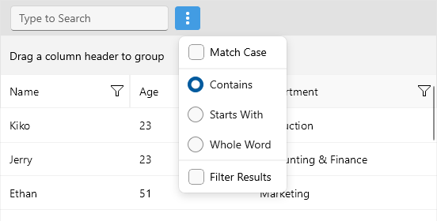
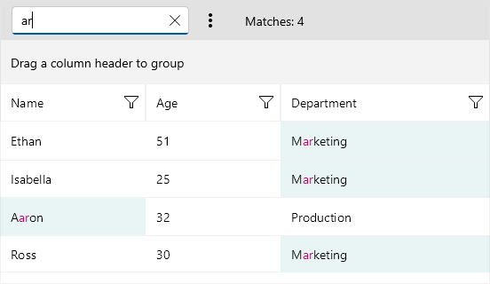
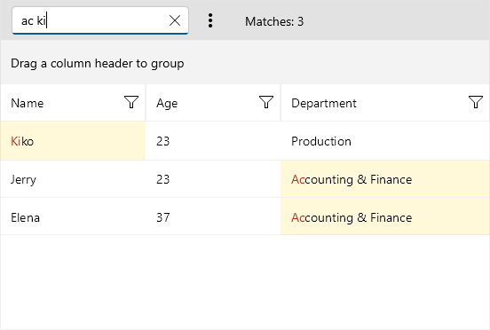

# .NET MAUI DataGrid Search as You Type

 [Telerik UI for .NET MAUI DataGrid]() provides the ability to search for specific data within its `ItemsSource` by using its built-in search functionality. The default behavior is to Search as You Type, but it can also be performed when the end user finishes typing and presses `Enter`.

Through the DataGrid's `SearchSettings` property, you can control when to show the search panel as well as configure the way the search is performed so that it best suits the end users' needs.

## Show or Hide the Search Panel

The `SearchSettings` of the DataGrid expose a `SearchPanelVisibilityMode` property, which controls when the search panel will appear. Here are the available options:

* `NeverVisible`&mdash;The search panel never appears.
* `ControlledByUser`&mdash;The search panel becomes visible after a user's interaction (pressing `Ctrl+F` on Windows or `Cmd+F` on Mac), and its Close button is also visible.
* `AlwaysVisible`&mdash;The search panel is always visible and its Close button is not visible.

## Search Panel UI

The search panel provides an input field (Entry) where the end user can enter the search term, and also some search options to choose from, such as whether to match the case, or whether to filter the results. The user can access the additional search settings through the Options button (the three dots) next to the Entry.

The image below shows the Search Panel UI on Windows:

## Search Settings

The default searching behavior works in the following way: as soon as the user types into the Entry, the search operation is initiated, taking the search term as it is and searching through the data. The results are filtered inside the DataGrid. 

Below you can find a list of the available configuration options applied through the `RadDataGrid.SearchSettings`:

* `IntermediateSearchText`(`string`)&mdash;Specifies the text of the search entry. A change of this value will not necessarily trigger a search, for example,it will not necessarily change the `SearchText` property. The `SearchText` property is updated in accordance with the `SearchTrigger` property.
* `SearchText`(`string`)&mdash;Specifies the search text. Before a search is started, the `SearchStarting` event is raised. The `SearchStarting` event allows for a change in the effective search text that will be used for searching.
* `SearchTrigger`(`DataGridSearchTrigger`)&mdash;Indicates when a search operation will be performed while the end user is typing in the search entry of the search panel. The available options are:
    * `TextChanged`&mdash;The search operation is triggered every time the text of the entry changes.
    * `Completed`&mdash;The search operation is triggered when the corresponding entry completes (by pressing `Enter` or `Return` key).
* `TextMatchMode`(`DataGridSearchTextMatchMode`)&mdash;Indicates how a search term will be used to find a match within the text. The available options are:
    * `Contains`&mdash;An item is marked as a search-match as long as the search text is found anywhere in the text element (cell or other).
    * `StartsWith`&mdash;An item is marked as a search-match only if the text of the text element (cell or other) contains a word that starts with the search text.
    * `WholeWord`&mdash;An item is marked as a search-match only if the text of the text element (cell or other) contains a word that matches the search text.
* `CaseSensitive`(`bool`)&mdash;Indicates whether the string comparison is case sensitive.
* `ApplyFilter`(`bool`)&mdash; Determines whether business items that do not satisfy the search criteria are filtered. By default `ApplyFilter` is `True`.
* `SearchMatchesCount`(`int`)&mdash;Gets the number of search matches.
* `ProvideSearchMatchesAction`(`Action<DataGridSearchProbe>`)&mdash;Applies a custom action that is invoked when determining the search matches for an item. Use this action to specify search matches based on custom logic.

Here is an example on how you can configure the search through the `SearchSettings`:

**1.** Add the DataGrid definition to the page with the `SearchSettings` applied:

<snippet id='datagrid-search-xaml' />

**2.** Add the ViewModel class:

<snippet id='datagrid-search-viewmodel' />

**3.** Add the data item used for binding the DataGrid:

<snippet id='datagrid-search-object' />

Check the result at the image below:

## Highlighting

The DataGrid provides highlighting of the search results with the matched chunks of text also highlighted to make them easily noticeable and improve the overall search experience.

You can customize the highlighting colors with the `CellContentStyle.SearchMatchTextColor` and `CellDecorationStyle.SearchMatchBackgroundColor` of the DataGrid Columns. 

Check a quick example on how to modify the highlighting colors:

**1.** Add the DataGrid to the page - define the columns manually in order to apply `CellContentStyle` and `CellDecorationStyle` properties:

<snippet id='datagrid-search-highlighting-xaml' />

**2.** Add the corresponding `DataGridTextCellStyle` and `MyCellDecorationStyle` to the page's resources:

<snippet id='datagrid-search-highlighting-styles' />

## Events

To further customize the Search as You Type functionality, use the `SearchStarting` event&mdash;Raised before searching starts. The effective search text can be changed, for example trimmed, divided into separate search terms, and searching can be cancelled from the arguments of the event:

* The sender argument, which is of type `object`, but can be cast to the `RadDataGrid` type.
* A `DataGridSearchStartingEventArgs` object, which provides:
     * `SearchTerms`(`IList<string>`)&mdash;The different search terms that should be searched for.
     * `SearchTermsLogicalOperator`(`LogicalOperator`)&mdash;The logical operator that is used when more than one search term is searched for.
     * `Cancel`(`bool`)&mdash;Indicates whether to cancel the search.

Here is an example of how you can utilize `SearchStarting` to modify the way the search is performed—for example, divide the search text into separate search terms and search for all of them using the OR operator:

**1.** Add the DataGrid definition to the page with the `SearchSettings` applied:

<snippet id='datagrid-search-xaml' />

**2.** Add a sample `SearchStarting` event handler:

<snippet id='scheduler-search-searchstarting-event' />

## Commands

The `DataGrid.SearchSettings` allows you to attach commands that will be executed when certain actions such as closing the search panel occur.

* `CloseSearchPanelCommand`&mdash;Called when pressing the Close button in the search panel.
* `SearchEntryCompletedCommand`&mdash;Called when the `Completed` event of the search entry in the search panel is raised.

## See Also

- [Localization in .NET MAUI DataGrid]()
- [Defining Columns]()
- [Columns Styling]()
