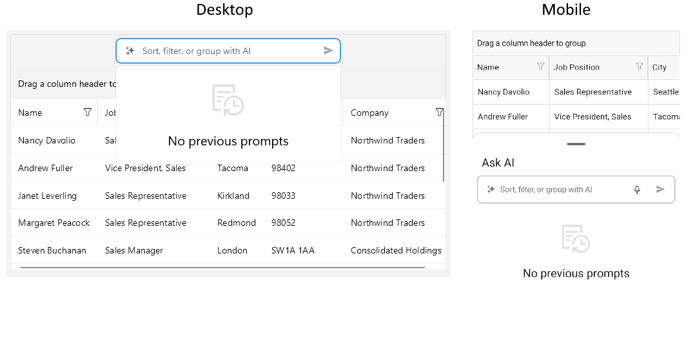
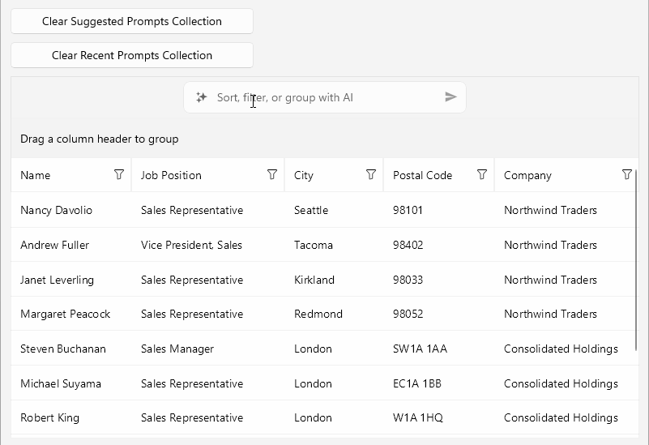

# Configure the AI Smart Assistant in .NET MAUI DataGrid

This article provides information on how to configure the AI Smart Assistant  functionality in the .NET MAUI DataGrid control.

## AI Smart Assistant  Settings

You can configure the default settings for the AI Smart Assistant  functionality using the `AISettings` (of type `Telerik.Maui.Controls.DataGrid.DataGridAISettings`) property of the DataGrid. 

Below you can find a list of the available configuration options applied through the `RadDataGrid.AISettings`:

* `InputText` (`string`)&mdash;Specifies the text of the input field.
* `SubmitPromptOnSelection` (`bool`)&mdash;Specifies whether selecting a prompt should automatically submit the request. The default value is `false`.
* `OpenOnFocus` (`bool`)&mdash;Specifies whether the prompt input should open the suggestions dropdown when the input field is focused. The default value is `true`.
* `IsSuggestedPromptsVisible` (`bool`)&mdash;Specifies whether the suggested prompts should be visible. The default value is `true`.
* `IsRecentPromptsVisible` (`bool`)&mdash;Specifies whether the recent prompts should be visible. The default value is `true`.
* `IsEmptyContentVisible` (`bool`)&mdash;Specifies whether the empty content message should be visible when no suggestions are available. The default value is `true`.
* `SuggestedPrompts` (`IEnumerable<string>`)&mdash;Specifies the collection of suggested prompts.
* `RecentPrompts` (`IEnumerable<string>`)&mdash;Specifies the collection of recent prompts.

This is how the default AI Smart Assistant  view looks like when there are no suggestions and recent prompts available and the `IsEmptyContentVisible` property is set to `True`:

## Events

The DataGrid provides the following events related to AI Smart Assistant functionality:

* `PromptRequest`&mdash;Occurs when a prompt is submitted from the AI Smart Assistant panel.
	* The `sender` argument, which is of type `object`, but can be cast to the `RadDataGrid` type.
	* A `DataGridPromptRequestEventArgs` object, which provides the following properties:
		- `Prompt`&mdash;Gets the prompt text that was submitted from the user.
		- `RequestJson`&mdash;Specifies the JSON request sent to the AI model.
		- `ResponseJson`&mdash;Specifies the response text.
		- `HasError`&mdash;Specifies whether an error occurred during processing.

* `CancelPromptRequest`&mdash;Occurs when the user requests to cancel the current AI processing operation
	* The `sender` argument, which is of type `object`, but can be cast to the `RadDataGrid` type.
	* An `EventHandler` object.

## Commands

* `PromptRequestCommand` (`ICommand`)&mdash;Gets the command that is executed when a prompt request is submitted. The command parameter is of type `Telerik.Maui.Controls.DataGrid.DataGridPromptRequestCommandContext`.
* `CancelPromptRequestCommand` (`ICommand`)&mdash;Gets the command that is executed when canceling a prompt request. The command parameter is of type `object`.

## Example

Here is an example of how to configure the AI Smart Assistant  settings in the .NET MAUI DataGrid:

**1.** Add the DataGrid definition in XAML:

<snippet id='datagrid-prompt-controlled-configuration' />

**2.** Add the `telerik` namespace:
 
`xmlns:telerik="http://schemas.telerik.com/2022/xaml/maui"`

**3.** Add sample data model:

<snippet id='datagrid-prompt-configuration-model' />

**4.** Define the data for the DataGrid `ItemsSource`:

<snippet id='datagrid-prompt-load-sample-data' />

**5.** Define the prompt handling properties:

<snippet id='datagrid-promptrequest-handling-view' />

**6.** Handle the `PromptRequest` event in the code-behind:

<snippet id='datagrid-promptrequest-handling' />

**7.** Handle the `CancelPromptRequest` event in the code-behind:

<snippet id='datagrid-cancel-promptrequest-handling' />

**8.** Add items to the suggested prompts collection:

<snippet id='datagrid-aiprompt-config-suggested-prompts-collection' />

**9.** Add items to the recent prompts collection:

<snippet id='datagrid-aiprompt-config-recent-prompts-collection' />

**10.** Assig the collections to the `AISettings`:

<snippet id='datagrid-aiprompt-config-assign-collections' />

**11.** Set the data to the DataGrid `ItemsSource`:

<snippet id='datagrid-prompt-load-sample-data-call' />

>important The DataGrid AI Smart Assistant examples in the [SDKBrowser Demo Application]() use a Telerik-hosted AI service for demonstration purposes only. 
>You have to configure your own AI service for the AI Smart Assistant to work in your application.
>How to do that is described in the [Getting Started with the AI Smart Assistant](#getting-started-with-the-ai-smart-assistant) article.

>tip For a runnable example demonstrating the configuration options, see the [SDKBrowser Demo Application]() and go to the **DataGrid > AI Smart Assistant** category.

## See also

- [Prompt Controlled Overview]()
- [Style the AI Smart Assistant Templates]()
- [Templates for AI Smart Assistant]()