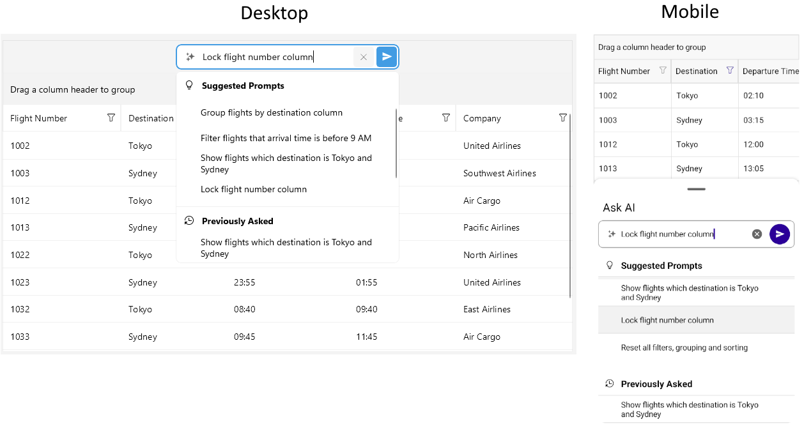

# AI Smart Assistant in .NET MAUI DataGrid

The .NET MAUI DataGrid control offers AI-powered features that allow users to interact with the DataGrid using natural language prompts. This functionality enables users to perform various operations such as sorting, grouping, filtering, and manipulating columns without needing to write code.

On mobile the AI Smart Assistant panel can be accessed via a floating action button on the bottom-right corner of the DataGrid. On desktop platforms, the AI Smart Assistant panel displays above the header area of the DataGrid.



## Supported Operations

The following operations can be performed using AI Smart Assistant:

- **Sorting**&mdash;Users can sort the DataGrid by specifying the column and the sort direction (ascending or descending).
- **Grouping**&mdash;Users can group the DataGrid by one or more columns.
- **Filtering**&mdash;Users can filter the DataGrid based on specific criteria.
- **Column Manipulation**&mdash;Users can freeze, hide columns and more.

## Getting Started with the AI Smart Assistant

To get started with the AI Smart Assistant functionality in the .NET MAUI DataGrid, follow the steps:

### Prerequisites

1. `.NET9` or later.
1. An AI provider. For example **Azure OpenAI** or **OpenAI**, etc.
1. `Telerik.AI.SmartComponents.Extensions` package.

### 1. Getting Started with the Telerik.AI.SmartComponents.Extensions

The AI Smart Assistant functionality relies on the [`Telerik.AI.SmartComponents.Extensions`](https://www.nuget.org/packages/Telerik.AI.SmartComponents.Extensions) package. The package provides the necessary extensions to integrate AI capabilities into the DataGrid. 

1. Install the [`Telerik.AI.SmartComponents.Extensions`](https://www.nuget.org/packages/Telerik.AI.SmartComponents.Extensions) package in your .NET MAUI project.

```script
dotnet add package Telerik.AI.SmartComponents.Extensions
```
```xml
<PackageReference Include="Telerik.AI.SmartComponents.Extensions" Version="Select Latest" />
```

The `Telerik.AI.SmartComponents.Extensions` package has a dependency to the `Microsoft.Extensions.AI` package

2. Configure the AI services in your application. This typically involves setting up an AI provider (such as **Azure OpenAI**, **OpenAI**, etc.) and providing the necessary API keys or credentials.

3. Register the AI service and AI chat client in your application. 

    For the example, we will use the **Azure OpenAI**. For the demo, in order to register the AI service and chat client, the following code is needed in MauiProgram.cs:

    ```C#
    builder.Services.AddSingleton(sp =>
    {
        return new AzureOpenAIClient(new Uri("AZURE_OPENAI_ENDPOINT"), new AzureKeyCredential("AZURE_OPENAI_API_KEY"));
    });

    builder.Services.AddChatClient(services =>
        services.GetRequiredService<AzureOpenAIClient>().GetChatClient("gpt-4.1").AsIChatClient()
    );
    ```

### 2. Process DataGrid AI Requests

1. How to access the AI model in the VieModel is a developer decision.

1. The `Telerik.AI.SmartComponents.Extensions` library provides two key methods:
    - `AddGridChatTools()`&mdash;Configures the AI model with DataGrid-specific capabilities.
    - `ExtractGridResponse()`&mdash;Extracts structured commands and messages from the AI response that the DataGrid can understand.

    For the demo we will use a command in the `ViewModel`. The command is bind to the DataGrid `UserCommand`. The command executes when a prompt is submitted from the AI Smart Assistant panel. 

    Here is a sample `ViewModel` definition:

    ```C#
    public class AIPromptViewModel : NotifyPropertyChangedBase
    {
        private CancellationTokenSource cancellationTokenSource;
        private ICommand processAICommand;
        private ICommand cancelAICommand;
        private readonly IChatClient chatClient;

        public AIPromptViewModel(IChatClient chatClient)
        {
            this.chatClient = chatClient;
        }

        public ICommand ProcessAICommand
        {
            get => this.processAICommand ?? (this.processAICommand = new Command<DataGridPromptRequestCommandContext>(this.ExecuteProcessAI));
        }

        public ICommand CancelAICommand
        {
            get => this.cancelAICommand ?? (this.cancelAICommand = new Command(this.ExecuteCancelAI));
        }

        private async void ExecuteProcessAI(DataGridPromptRequestCommandContext context)
        {
            if (this.cancellationTokenSource != null)
            {
                // An AI request is already being processed
                return;
            }

            this.cancellationTokenSource = new CancellationTokenSource();

            try
            {
                var request = JsonSerializer.Deserialize<GridAIRequest>(context.RequestJson);

                var options = new ChatOptions();
                options.AddGridChatTools(request.Columns);

                List<ChatMessage> messages = request.Contents.Select(m => new ChatMessage(ChatRole.User, m.Text)).ToList();

                ChatResponse completion = await this.chatClient.GetResponseAsync(messages, options); ;
                var response = JsonSerializer.Serialize(completion.ExtractGridResponse(), new JsonSerializerOptions() { PropertyNamingPolicy = JsonNamingPolicy.CamelCase });

                context.ResponseJson = response;
            }
            catch (OperationCanceledException)
            {
                // Cancellation was already handled by setting ProcessingState to Canceled
                // No need to set it again here
            }
            catch (Exception ex)
            {
                await this.ShowErrorAsync($"Failed to process request: {ex.Message}");
                context.HasError = true;
            }
            finally
            {
                this.cancellationTokenSource?.Dispose();
                this.cancellationTokenSource = null;
            }
        }

        private void ExecuteCancelAI()
        {
            this.cancellationTokenSource?.Cancel();
        }

        protected async Task ShowErrorAsync(string message)
        {
    #if NET10_0_OR_GREATER
            await Microsoft.Maui.Controls.Application.Current?.Windows[0].Page?.DisplayAlertAsync("Error", message, "OK");
    #else
            await Microsoft.Maui.Controls.Application.Current?.Windows[0].Page?.DisplayAlert("Error", message, "OK");
    #endif
        }
    }
    ```

    • Deserializes the incoming `JSON` `(context.RequestJson)` into a `GridAIRequest`. This contains grid columns and user prompt contents.

    • Creates `ChatOptions` and registers DataGrid-specific tools via `options.AddGridChatTools(request.Columns)` so the AI knows what columns/operations are available.

    • Maps each request content to a `ChatMessage` with `ChatRole.User`.

    • Calls the AI backend through `IChatClient.GetResponseAsync(messages, options)` to get a `ChatResponse`.

    • Extracts the grid-specific instruction payload from the AI result with `completion.ExtractGridResponse()`.

    • Serializes that payload to `JSON` and assign to `context.ResponseJson` for the DataGrid to consume.

1. Get the service registered in the `MauiProgram.cs` and pass it to the instance of the `ViewModel`. Then set the binding context of the page to be this `ViewModel`.

    ```C#
    var chatClient = Application.Current.Handler.MauiContext.Services.GetRequiredService<IChatClient>();
    this.viewModel = new AIPromptViewModel(chatClient);
    this.BindingContext = this.viewModel;
    ```


1. Set the DataGrid's `IsAIEnabled` property to `true`. When setting to `true`, the AI Smart Assistant panel will be enabled, allowing users to input prompts.

## Example Prompts

Here are some example prompts that users can use to interact with the DataGrid:

- "Sort the data by the Name column in ascending order."
- "Group the data by the Category column."
- "Filter the data to show only items with a price greater than 100."
- To freeze a column use the `lock` keyword. For example: "Lock the Price column."

## Example with AI Smart Assistant

**1.** Add DataGrid definition in XAML:

<snippet id='datagrid-prompt-controlled' />

**2.** Add the `telerik` namespace:
 
`xmlns:telerik="http://schemas.telerik.com/2022/xaml/maui"`

**3.** Add sample data model:

<snippet id='datagrid-prompt-model' />

**4.** Define the `ViewModel`:

<snippet id='datagrid-prompt-viewmodel' />

>important The DataGrid AI Smart Assistant examples in the [SDKBrowser Demo Application]() use a Telerik-hosted AI service for demonstration purposes only. 
>You have to configure your own AI service for the AI Smart Assistant to work in your application.
>How to do that is described in the [Getting Started with the AI Smart Assistant](#getting-started-with-the-ai-smart-assistant) article.

>tip For a runnable example demonstrating the AI Smart Assistant, see the [SDKBrowser Demo Application]() and go to the **DataGrid > AI Smart Assistant** category.

## See also

- [AI Smart Assistant Overview]()
- [Style the AI Smart Assistant Templates]()
- [Configure the AI Smart Assistant]()
- [Templates for AI Smart Assistant]()