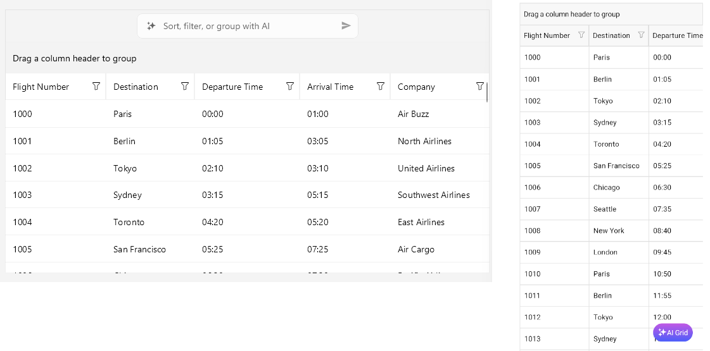

# AI Smart Assistant in .NET MAUI DataGrid

The .NET MAUI DataGrid control offers AI-powered features that allow users to interact with the DataGrid using natural language prompts. This functionality enables users to perform various operations such as sorting, grouping, filtering, and manipulating columns without needing to write code.

On mobile, the AI Smart Assistant panel can be accessed via a floating action button on the bottom-right corner of the DataGrid. On desktop platforms, the AI Smart Assistant panel displays above the header area of the DataGrid.

Here is how the AI Smart Assistant panel is arranged on desktop, with the panel above the DataGrid header area, and on mobile, where it is opened from a floating action button in the bottom-right corner of the DataGrid:

Here is how the AI Smart Assistant panel behaves on desktop and mobile when no suggestions are shown:

> When no suggestions are available, the AI Smart Assistant panel shows only the prompt input area and any configured helper text, without a suggestions list.

## Supported Operations

The following operations can be performed using AI Smart Assistant:

- **Grouping**&mdash;Users can group the DataGrid by one or more columns.
@[template](/_contentTemplates/controls/ai-data-operations.md#ai-smart-assistant-operations)

## Getting Started with the AI Smart Assistant

To get started with the AI Smart Assistant functionality in the .NET MAUI DataGrid, follow the steps:

@[template](/_contentTemplates/controls/ai-data-operations.md#getting-started-with-the-ai-smart-assistant)

### 2. Process DataGrid AI Requests

@[template](/_contentTemplates/controls/ai-data-operations.md#process-requests)

1. Set the DataGrid's `IsAIEnabled` property to `true`. When setting to `true`, the AI Smart Assistant panel gets enabled, allowing users to input prompts.

## Example Prompts

Here are some example prompts that users can use to interact with the DataGrid:

- "Group the data by the Category column."
@[template](/_contentTemplates/controls/ai-data-operations.md#example-prompts)

## Example with AI Smart Assistant

**1.** Add DataGrid definition in XAML:

<snippet id='datagrid-prompt-controlled' />

**2.** Add the `telerik` namespace:
 
`xmlns:telerik="http://schemas.telerik.com/2022/xaml/maui"`

**3.** Define the `DataGridUserCommand`:

<snippet id='datagrid-user-command' />

**3.** Add sample data model:

<snippet id='datagrid-prompt-model' />

**4.** Define the `ViewModel`:

<snippet id='datagrid-prompt-viewmodel' />

**5.** Define the user command for the `ProcessAICommand` and `CancelAICommand`:

<snippet id='datagrid-user-command' />

>important The DataGrid AI Smart Assistant examples in the [SDKBrowser Demo Application]() use a Telerik-hosted AI service for demonstration purposes only. 
>
>To use the AI Smart Assistant in your application, you must configure your own AI service.
>
>How to do that is described in the [Getting Started with the AI Smart Assistant](#getting-started-with-the-ai-smart-assistant) article.

>tip For a runnable example demonstrating the AI Smart Assistant, see the [SDKBrowser Demo Application]() and go to the **DataGrid > AI Smart Assistant** category.

## See also

- [AI Smart Assistant Overview]()
- [Style the AI Smart Assistant]()
- [Configure the AI Smart Assistant]()
- [Templates for AI Smart Assistant]()