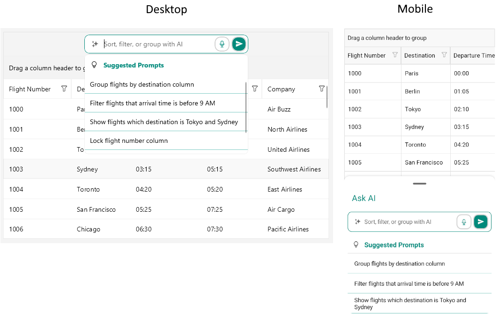

# .NET MAUI DataGrid AI Smart Assistant Styling

The .NET MAUI DataGrid control allows you to customize the appearance of the AI Smart Assistant feature to match your application's design requirements. You can modify various visual aspects of the AI Smart Assistant  panel, including colors, fonts, and layout.

## Style the AI Smart Assistant  Input

You can customize the appearance of the AI Smart Assistant panel by using the `PromptInputStyle` property. The property is of type `Style` with a target type of `Telerik.Maui.Controls.DataGrid.DataGridAIPromptInput`.

By default, the AI Smart Assistant  input includes a Speech-to-Text button that allows users to input prompts using voice commands. You can customize the appearance of this button by using the `SpeechToTextButtonStyle` (`Style` with a target type of `Telerik.Maui.Controls.RadSpeechToTextButton`) property.

The available properties for the `PromptInputStyle` are described below:

* `BackgroundColor` (`Color`)&mdash;Specifies the background color of the AI Smart Assistant input.
* `BorderColor` (`Color`)&mdash;Specifies the border color around the AI Smart Assistant input.
* `BorderBrush` (`Brush`)&mdash;Specifies the border brush around the AI Smart Assistant input.
* `BorderThickness` (`Thickness`)&mdash;Specifies the border thickness around the AI Smart Assistant input.
* `CornerRadius` (`Thickness`)&mdash;Specifies the corner radius of the border around the AI Smart Assistant input.
* `TextInputStyle` (`Style` with target type of `Telerik.Maui.Controls.RadTextInput`)&mdash;Specifies the style of the text input field within the AI Smart Assistant input.
* `ClearButtonStyle` (`Style` with target type of `Telerik.Maui.Controls.RadTemplatedButton`)&mdash;Specifies the style of the clear button within the AI Smart Assistant input.
* `SendButtonStyle` (`Style` with target type of `Telerik.Maui.Controls.RadTemplatedButton`)&mdash;Specifies the style of the send button within the AI Smart Assistant input.
* On WinUI, the Speech-to-Text button is not displayed by default. To enable it, set the `IsSpeechToTextButtonVisible` property to `True`.

Here is an example of how to style the AI Smart Assistant input:

<snippet id='datagrid-prompt-input-style' />

## Style the SuggestionsView

You can customize the appearance of the `SuggestionsView` that displays the suggested and recent prompts by using the `SuggestionsViewStyle` property. The property is of type `Style` with a target type of `Telerik.Maui.Controls.DataGrid.DataGridAISuggestionsView`.

The available properties for the `SuggestionsViewStyle` are described below:

* `BackgroundColor` (`Color`)&mdash;Specifies the background color of the dropdown with the suggestions.
* `BorderColor` (`Color`)&mdash;Specifies the border color around the dropdown with the suggestions.
* `BorderBrush` (`Brush`)&mdash;Specifies the border brush around the dropdown with the suggestions.
* `BorderThickness` (`Thickness`)&mdash;Specifies the border thickness around the dropdown with the suggestions.
* `CornerRadius` (`Thickness`)&mdash;Specifies the corner radius of the border around the dropdown with the suggestions.
* `SuggestedPromptsLabelStyle` (`Style` with target type of `Label`)&mdash;Specifies the style of the label for the suggested prompts section.
* `RecentPromptsLabelStyle` (`Style` with target type of `Label`)&mdash;Specifies the style of the label for the recent prompts section.
* `SuggestedPromptsIconStyle` (`Style` with target type of `Label`)&mdash;Specifies the style of the icon for the suggested prompts.
* `RecentPromptsIconStyle` (`Style` with target type of `Label`)&mdash;Specifies the style of the icon for the recent prompts.
* `SuggestedPromptsCollectionViewStyle` (`Style` with target type of `Telerik.Maui.Controls.RadCollectionView`)&mdash;Specifies the style of the collection view that displays the suggested prompts.
* `RecentPromptsCollectionViewStyle` (`Style` with target type of `Telerik.Maui.Controls.RadCollectionView`)&mdash;Specifies the style of the collection view that displays the recent prompts.
* `SeparatorStyle` (`Style` with target type of `Rectangle`)&mdash;Specifies the style of the separator between the suggested and recent prompts sections.

Here is an example of how to style the SuggestionsView:

<snippet id='datagrid-promptcontrolled-suggestionview-style' />

## Style the floating action button (Mobile)

You can customize the appearance of the floating action button that opens the AI Smart Assistant  panel on mobile by using the `FloatingActionButtonStyle` property. The property is of type `Style` with a target type of `Telerik.Maui.Controls.DataGrid.DataGridFloatingActionButton`.

The DataGridFloatingActionButton inherits from the `RadTemplatedButton`. All styling properties and visual states available for the `RadTemplatedButton` can be applied to the floating action button.

For more information about styling the `RadTemplatedButton`, refer to the [Styling article](), for available visual states&mdash;[Visual States article]().

Here is an example of how to style the floating action button:

<snippet id='datagrid-promptcontrolled-floatingaction-button-style' />

## Style the BottomSheet (Mobile)

You can customize the appearance of the BottomSheet that contains the AI Smart Assistant panel and the suggestions on mobile by using the following properties:

`BottomSheetContentHeaderLabelStyle` (`Style` with target type of `Label`) property.
`BottomSheetContentStyle` (`Style` with target type of `Telerik.Maui.Controls.BottomSheet.BottomSheetContentView`) property.

The available properties for the `BottomSheetContentStyle` are described below:

* `BackgroundColor` (`Color`)&mdash;Specifies the background color of the BottomSheetContent.
* `BorderColor` (`Color`)&mdash;Specifies the border color around the BottomSheetContent.
* `BorderBrush` (`Brush`)&mdash;Specifies the border brush around the BottomSheetContent.
* `BorderThickness` (`Thickness`)&mdash;Specifies the border thickness around the BottomSheetContent.
* `CornerRadius` (`Thickness`)&mdash;Specifies the corner radius of the border around the BottomSheetContent.

Here is an example of how to style the BottomSheet header label:

<snippet id='datagrid-promptcontrolled-bottomsheet-contentheaderlabel-style' />

Here is an example of how to style the BottomSheet content:

<snippet id='datagrid-promptcontrolled-bottomsheet-content-style' />

>important The DataGrid AI Smart Assistant examples in the [SDKBrowser Demo Application]() use a Telerik-hosted AI service for demonstration purposes only. 
>You have to configure your own AI service for the AI Smart Assistant to work in your application.
>How to do that is described in the [Getting Started with the AI Smart Assistant](#getting-started-with-the-ai-smart-assistant) article.

>tip For a runnable example demonstrating the configuration options, see the [SDKBrowser Demo Application]() and go to the **DataGrid > AI Smart Assistant** category.

## See also

- [AI Smart Assistant Overview]()
- [Configure the AI Smart Assistant]()
- [Templates for AI Smart Assistant]()