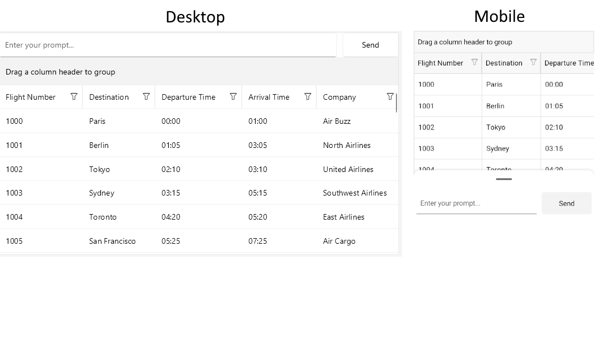
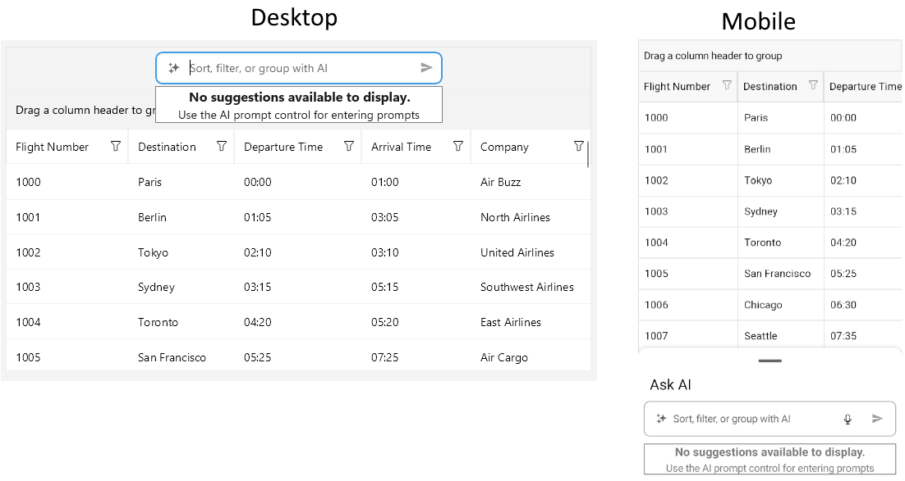

# .NET MAUI DataGrid AI Smart Assistant Templates

The .NET MAUI DataGrid control allows you to override the built-in templates for the AI Smart Assistant feature to create a customized user experience.

Use the `AIViewTemplate` (`DataTemplate`) property on DataGrid level to override the default template for the `DataGridAIPromptInput`.

Use the `EmptyContentTemplate` (`DataTemplate`) property on `AISettings` level to override the default template for the empty content view displayed when there are no suggestions available.

>tip When you define both templates, the `AIViewTemplate` takes precedence over the `EmptyContentTemplate`.

Here is an example of how to define custom templates for the AI Smart Assistant feature.

An example of `AIViewTemplate`:

<snippet id='datagrid-promptcontrolled-aiview-template' />

This is how the custom `AIViewTemplate` looks like when applied:

An example of `EmptyContentTemplate`:

<snippet id='datagrid-promptcontrolled-empty-template' />

This is how the custom `EmptyContentTemplate` looks like when applied:

>important The DataGrid AI Smart Assistant examples in the [SDKBrowser Demo Application]() use a Telerik-hosted AI service for demonstration purposes only. 
>You have to configure your own AI service for the AI Smart Assistant to work in your application.
>How to do that is described in the [Getting Started with the AI Smart Assistant](#getting-started-with-the-ai-smart-assistant) article.

>tip For a runnable example demonstrating a custom templates, see the [SDKBrowser Demo Application]() and go to the **DataGrid > AI Smart Assistant** category.

## See also

- [Prompt Controlled Overview]()
- [Style the AI Smart Assistant Templates]()
- [Configure the AI Smart Assistant]()
