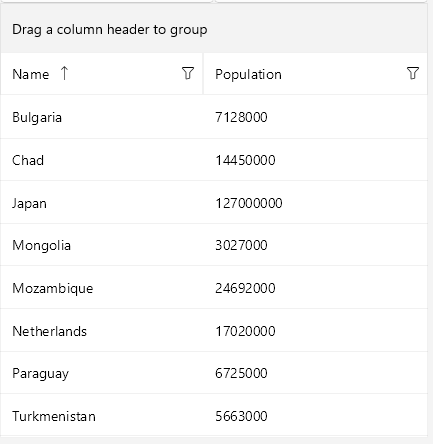

# Sorting

The DataGrid provides a built-in sorting functionality which allows the user to order the view of the data the control represents. Sorting the control is possible both through the UI and programmatically.

## Sorting through the UI

* Sort through the UI by clicking or tapping the column header. `UserSortMode` defines how user input (column header tap/click) affects the current sort state of the grid. The available options are `Auto`, `Multiple`, `None`, and `Single`. The default value of the `UserSortMode` is `Auto`.

The `CanUserSort` (bool) property is used to enable or disable the sorting of a specific column. It defines a value indicating whether the user can sort the data by the values in the column.

## Programmatic Sorting

The DataGrid provides two ways of programmatic sorting:

* By a property with a [PropertySortDescriptor](#property-sort-descriptor)
* By a custom key with a [DelegateSortDescriptor](#delegate-sort-descriptor)

### Property Sort Descriptor

You can sort the data in a DataGrid by pointing a property from the class that defines your objects. This can be achieved with a `PropertySortDescriptor` and setting its `PropertyName` property. The descriptor exposes the following important properties:

* `PropertyName`&mdash;Gets or sets the name of the property that is used to retrieve the key to sort by.
* `SortOrder`&mdash;Gets or sets the order of the sorting (ascending or descending).

```XAML
<telerikDataGrid:RadDataGrid.SortDescriptors>
	<telerikCommon:PropertySortDescriptor PropertyName="Name"/>
</telerikDataGrid:RadDataGrid.SortDescriptors>
```

In the example, the used namespaces are defined like this:

```XAML
xmlns:telerikDataGrid="clr-namespace:Telerik.XamarinForms.DataGrid;assembly=Telerik.Maui.Controls.Compatibility"
xmlns:telerikCommon="clr-namespace:Telerik.XamarinForms.Common.Data;assembly=Telerik.Maui.Controls.Compatibility"
```

### Delegate Sort Descriptor

The difference between the `DelegateSortDescriptor` and the `PropertySortDescriptor` is that the `DelegateSortDescriptor` sorts data by a custom key, while the `PropertySortDescriptor` sorts by a defined key, which is a property from the model.

It exposes the following properties:

* `KeyLookup`&mdash;Gets or sets the `IKeyLookup` instance that is used to retrieve the sort key for each data item.
* `SortOrder`&mdash;Gets or sets the order of the sorting (ascending or descending).

To use a `DelegateSortDescriptor`, you need to create a class that implements the `IKeyLookup` interface which will return the key by which you want to sort. Then, you need to add the `DelegateSortDescriptor` to the `RadDataGrid.SortDescriptors` collection and set its `KeyLookUp` property.

The following example demonstrates a custom `IKeyLookup` implementation.

<snippet id='datagrid-delegatesortdescriptor-ikeylookup'/>
```C#
public class CustomIKeyLookup : IKeyLookup
{
	public object GetKey(object instance)
	{
		return (instance as Club).Name.Length;
	}
}
```

Add it to the `GroupDescriptors` collection of the DataGrid:

<snippet id='datagrid-delegatesortdescriptor-csharp'/>
```C#
this.dataGrid.SortDescriptors.Add(new DelegateSortDescriptor() { KeyLookup = new CustomIKeyLookup()});
```

Here is how the DataGrid looks when sorting is applied:




## See Also

- [Columns]()
- [Grouping]()
- [Filtering]()
- [Selection]()
