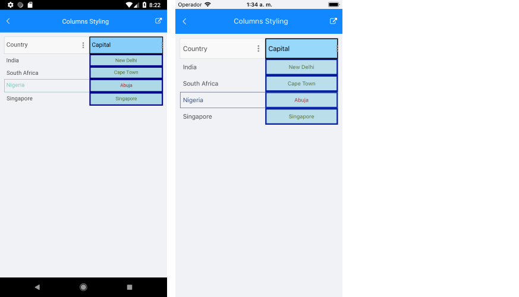

# Columns Styling

The DataGrid component provides styling mechanism for customizing the look of the columns and their cells.

The styling mechanism is represented by the following properties:
* `HeaderStyle` (`DataGridColumnHeaderStyle`)
* `CellContentStyle` (`Style` with `TargetType` depending on the column type)
* `CellDecorationStyle` (`DataGridBorderStyle`)
* `CellEditorStyle` (`Style` with `TargetType` depending on the editor type)

## HeaderStyle

`HeaderStyle` defines the appearance of the column header. The `DataGridColumnHeaderStyle` exposes properties for styling its header, filter indicator, indicator, **Options** button, and sorting indicator.

### Header Styling

To style the `RadDataGridColumnHeader` use the following properties:

* `TextColor` and `BackgroundColor`&mdash;Define the colors of the text part/background respectively.
* `BorderColor` and `BorderThickness`&mdash;Define the style of the border around the column header.
* `Font Options` (`TextFontAttributes`, `TextFontFamily`, `TextFontSize`)&mdash;Define the font options to the text part of the `ColumnHeader`.
* `Text Alignment` (`TextMargin`, `HorizontalTextAlignment`, `VerticalTextAlignment`)&mdash;Define the positioning for the text part of the `ColumnHeader`.

<snippet id='datagrid-columnstyle-headerstyle'/>

### SortIndicator Styling

The `SortIndicator` is shown once the `RadDataGridColumnHeader` is sorted (tapped/clicked on the `ColumnHeader` cell) and can be styled with the following properties:

* `SortIndicatorColor`&mdash;Defines the color for the sort indicator part of the `ColumnHeader`.  
* `SortIndicatorMargin`&mdash;Defines the margin of the sort indicator part of the `ColumnHeader`.
* `SortIndicatorAscendingText`&mdash;Defines the text of the sort indicator when the sorting is ascending.
* `SortIndicatorDescendingText`&mdash;Defines the text of the sort indicator when the sorting is descending.

>note By default, the indicator is represented by a string symbol that can be changed by using the `IndicatorText` and `IndicatorFontFamily` properties. For more details, refer to the [article on sorting the DataGrid]().

### OptiponsButton Styling

> OptionsButton (three dots) is visualized only on Android and iOS. The button opens the built-in filtering UI.

Style the `OptiponsButton` using the following properties:

* `OptiponsButtonTextColor`&mdash;Defines the color for the option indicator part of the `ColumnHeader`.  
* `OptiponsButtonText`&mdash;Defines the text for the option indicator part of the `ColumnHeader`.  
* `OptiponsButtonMargin`&mdash;Defines the margin of the option indicator part of the `ColumnHeader`.
* `Font Options`(`OptiponsButtonFontAttributes`, `OptiponsButtonFontFamily`, `OptiponsButtonFontSize`)&mdash;Define the font options to the option indicator text. 

### FilterIndicator Styling

> On Mobile (Android and iOS)&mdash;`FilterIndicator` is shown once the `RadDataGridColumnHeader` is filtered (tapped on the `ColumnHeader` cell) 
>
> On Desktop(MacCatalyst and Windows)&mdash;`FilterIndicator` is shown by default.

Style the `FilterIndicator` using the following properties:

* `FilterIndicatorTextColor`&mdash;Defines the color for the filter indicator part of the `ColumnHeader`.  
* `FilterIndicatorText`&mdash;Defines the text for the filter indicator part of the `ColumnHeader`.  
* `FilterIndicatorMargin`&mdash;Defines the margin of the filter indicator part of the `ColumnHeader`.
* `Font Options`(`FilterIndicatorFontAttributes`, `FilterIndicatorFontFamily`, `FilterIndicatorFontSize`)&mdash;Define the font options to the filter indicator text. 

## CellContentStyle

The `CellContentStyle` property defines the appearance of each cell associated with the column. The target type of the `Style` object depends on the type of the column. For example, for `DataGridTextColumn` it will be of the `TextBlock` type. You can go to the [Column Types section](), for example, to check the `TargetType` of each column type.

The following properties can be used to define the style of the text cell elements:

* `Font` options (`FontAttributes`, `FontFamily`, `FontSize`)&mdash; Define the font of the cell text.
* `TextColor`/`SelectedTextColor`&mdash;Define the color of the cells text. You can set a different value for the selected cell.
* `Text` alignment (`TextMargin`, `HorizontalTextAlignment`, `VerticalTextAlignment`)&mdash;Define the positioning of the text inside the cell.

Here is an example how to set the `CellContentStyle` property:

<snippet id='datagrid-columnstyle-cellcontent'/>

## CellDecorationStyle

To style the border of each cell associated with the column the `CellDecorationStyle` property is used. `CellDecorationStyle` is of type `DataGridBorderStyle` which provides the following properties&mdash;`BackgroundColor`, `BorderColor`, `BorderTickness`.

Here is an example how to set those properties on a column:

<snippet id='datagrid-columnstyle-celldecoration'/>

## CellEditorStyle

`CellEditorStyle` defines the style that will be applied to the cell editor.

Here is an example how to set this property:

<snippet id='datagrid-columnstyle-celleditor'/>

And this is how the column style looks when the properties for customizing the column are applied:

## See Also

- [DataGrid Styling]()
- [Style Selectors]()
