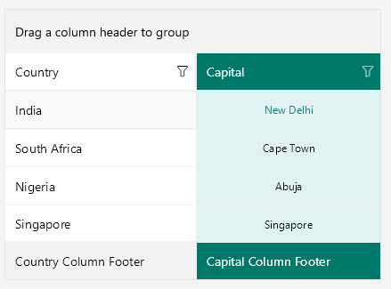

# .NET MAUI DataGrid Columns Styling

The DataGrid component provides styling mechanism for customizing the look of the columns and their cells.

The styling mechanism is represented by the following properties:

* `HeaderStyle` (`DataGridColumnHeaderStyle`)&mdash;Sets the style to the columns' headers.
* `CellContentStyle` (`DataGridTextCellStyle`)&mdash;Defines the appearance of each cell associated with the column.
* `CellDecorationStyle` (`DataGridBorderStyle`)&mdash;Defines the style of the border of each cell associated with the column.
* `CellEditorStyle` (`Style` with `TargetType` depending on the editor type)&mdash;Defines the style that will be applied to the cell editor.
* `FooterStyle` (`DataGridColumnFooterStyle`)&mdash;Defines the appearance of the column footer.

## Header Style

`HeaderStyle` defines the appearance of the column header. The `DataGridColumnHeaderStyle` exposes properties for styling its header, filter indicator, indicator, **Options** button, and sorting indicator.

### Header Styling

To style the `RadDataGridColumnHeader` use the following properties:

* `TextColor` and `BackgroundColor`&mdash;Define the colors of the text part/background respectively.
* `BorderColor` and `BorderThickness`&mdash;Define the style of the border around the column header.
* `Font Options` (`TextFontAttributes`, `TextFontFamily`, `TextFontSize`)&mdash;Define the font options to the text part of the `ColumnHeader`.
* `Text Alignment` (`TextMargin`, `HorizontalTextAlignment`, `VerticalTextAlignment`)&mdash;Define the positioning for the text part of the `ColumnHeader`.

<snippet id='datagrid-columnstyle-headerstyle'/>

>tip For more details how to hide the column headers from the DataGrid visualization, review the following article: [How to Hide Column Headers in a DataGrid for MAUI]().

### SortIndicator Styling

The `SortIndicator` is shown once the `RadDataGridColumnHeader` is sorted (tapped/clicked on the `ColumnHeader` cell) and can be styled with the following properties:

* `SortIndicatorColor`&mdash;Defines the color for the sort indicator part of the `ColumnHeader`.  
* `SortIndicatorMargin`&mdash;Defines the margin of the sort indicator part of the `ColumnHeader`.
* `SortIndicatorAscendingText`&mdash;Defines the text of the sort indicator when the sorting is ascending.
* `SortIndicatorDescendingText`&mdash;Defines the text of the sort indicator when the sorting is descending.

>note By default, the indicator is represented by a string symbol that can be changed by using the `IndicatorText` and `IndicatorFontFamily` properties. For more details, refer to the [article on sorting the DataGrid]().

### Indicator Styling

Style the `Indicator` using the following properties:

* `IndicatorColor`&mdash;Defines the color for the indicator part of the `ColumnHeader`.
* `IndicatorText`&mdash;Defines the text for the indicator part of the `ColumnHeader`.  
* `IndicatorMargin`&mdash;Defines the margin of the option indicator part of the `ColumnHeader`.
* `Font Options`(`IndicatorFontAttributes`, `IndicatorFontFamily`, `IndicatorFontSize`)&mdash;Define the font options to the option indicator text. 

### FilterIndicator Styling

Style the `FilterIndicator` using the following properties:

* `FilterIndicatorTextColor`&mdash;Defines the color for the filter indicator part of the `ColumnHeader`.  
* `FilterIndicatorText`&mdash;Defines the text for the filter indicator part of the `ColumnHeader`. For the `FilterIndicatorText` to appear the `FilterIndicatorFontFamily` should be specified.
* `FilterIndicatorMargin`&mdash;Defines the margin of the filter indicator part of the `ColumnHeader`.
* `Font Options`(`FilterIndicatorFontAttributes`, `FilterIndicatorFontFamily`, `FilterIndicatorFontSize`)&mdash;Define the font options to the filter indicator text. 

## CellContentStyle

The `CellContentStyle` property defines the appearance of each cell associated with the column. `CellContentStyle` is of type `DataGridTextCellStyle` which provides the following properties for styling the cell text:

* `Font` options (`FontAttributes`, `FontFamily`, `FontSize`)&mdash;Define the font of the cell text.
* `TextColor`/`SelectedTextColor`&mdash;Define the color of the cells text. You can set a different value for the selected cell.
* `HoverTextColor`&mdash;Sets the color of the cells text when the mouse hovers over it. Appicable only on Desktop.
* `TextMargin`/ `HorizontalTextAlignment`/ `VerticalTextAlignment`)&mdash;Define the positioning of the text inside the cell.
* `SearchMatchTextColor`&mdash;Defines the color that is used for the parts of the text that are search matches.

Here is an example how to set the `CellContentStyle` property:

<snippet id='datagrid-columnstyle-cellcontent'/>

## CellDecorationStyle

To style the border of each cell associated with the column the `CellDecorationStyle` property is used. `CellDecorationStyle` is of type `DataGridBorderStyle` which provides the following properties&mdash;`BackgroundColor`, `BorderColor`, `BorderTickness`.

In addition, `DataGridBorderStyle` provides the `SearchMatchBackgroundColor` property used to apply a separate background color to the border when the cell contains a search-match. 

Here is an example how to set those properties on a column:

<snippet id='datagrid-columnstyle-celldecoration'/>

## CellEditorStyle

`CellEditorStyle` defines the style that will be applied to the cell editor.

Here is an example how to set this property:

<snippet id='datagrid-columnstyle-celleditor'/>

And this is how the column style looks when the properties for customizing the column are applied:

## FooterStyle

`FooterStyle` defines the appearance of the column footer. The `DataGridColumnFooterStyle` exposes the following properties for styling:

* `TextColor` and `BackgroundColor`&mdash;Define the colors of the text part/background respectively.
* `BorderColor` and `BorderThickness`&mdash;Define the style of the border around the column footer.
* `Font Options` (`TextFontFamily`, `TextFontAttributes`, `TextFontSize`)&mdash;Define the font options to the text part of the `ColumnFooter`.
* `Text Alignment` (`TextMargin`, `HorizontalTextAlignment`, `VerticalTextAlignment`)&mdash;Define the positioning for the text part of the `ColumnFooter`.

<snippet id='datagrid-columnstyle-footerstyle' />

## DataGrid Toggle Row Details Column Styling

`CellContentStyle` defines the appearance of the `DataGridToggleRowDetailsColumn`. The `DataGridToggleRowDetailsCellStyle` exposes the following properties for styling:

* `ButtonFontFamily`&mdash;Defines the font family for the toggle symbol.
* `ExpandButtonText`&mdash;Defines the text for the expanded state.
* `CollapseButtonText`&mdash;Defines the text for the collapsed state.
* `ButtonTextColor`&mdash;Defines the color for the toggle symbol.
* `SelectedButtonTextColor`&mdash;Defines the color for the toggle symbol when the item is selected.
* `HoverButtonTextColor`&mdash;Defines the color for the toggle symbol when the item is being hovered over.
* `ButtonFontSize`&mdash;Defines the font size for the toggle symbol.
* `ButtonFontAttributes`&mdash;Defines `Microsoft.Maui.Controls.FontAttributes` for the toggle symbol.
* `ButtonMargin`(type `Thickness`)&mdash;Defines the margin for the toggle symbol.

## See Also

- [DataGrid Styling]()
- [Style Selectors]()
- [Search as You Type]()
