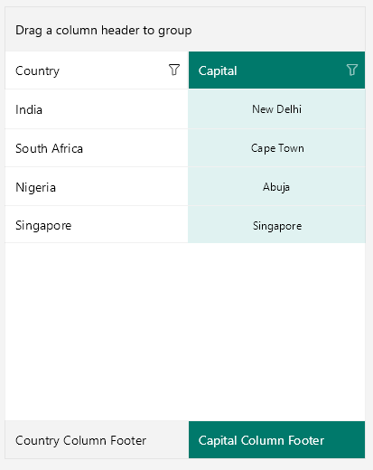

# Columns Styling

RadDataGrid component provides styling mechanism for customizing the look of the columns and their cells. 

The styling mechanism is represented by the following properties:
* **HeaderStyle** (DataGridColumnHeaderStyle)
* **CellContentStyle** (Style with TargetType depending on the column type)
* **CellDecorationStyle** (DataGridBorderStyle)
* **CellEditorStyle** (Style with TargetType depending on the editor type)

## HeaderStyle

HeaderStyle defines the appearance of the column header. The DataGridColumnHeaderStyle exposes properties for styling its header, filter indicator, indicator, options button, sorting indicator.

### Header Styling

To style the RadDataGridColumnHeader use the following properties:

* **TextColor** and **BackgroundColor**: Define the colors of the text part/background respectively.
* **BorderColor** and **BorderThickness**: Define the style of the border around the column header.
* **Font Options** (TextFontAttributes, TextFontFamily, TextFontSize): Define the font options to the text part of the ColumnHeader.
* **Text Alignment** (TextMargin, HorizontalTextAlignment, VerticalTextAlignment): Define the positioning for the text part of the ColumnHeader.

### SortIndicator Styling 

The **Indicator** is shown once the RadDataGridColumnHeader is sorted (tapped/clicked on the ColumnHeader cell) and can be styled with the following properties:

* **IndicatorColor**: Defines the color for the indicator part of the ColumnHeader.  
* **Indicator Font Options** (IndicatorFontAttributes, IndicatoFontFamily, IndicatoFontSize): Define the font options for the ColumnHeader indicator.
* **IndicatorMargin**: Defines the margin of the indicator part of the ColumnHeader.
* **IndicatorText**: Defines the text of the indicator part of the ColumnHeader. 
* **SortIndicatorAscendingText**: Defines the text of the sort indicator when the sorting is ascending.
* **SortIndicatorDescendingText**: Defines the text of the sort indicator when the sorting is descending.

>note By default, the indicator is represented by a string symbol that could be changed using **IndicatorText** and **IndicatorFontFamily** properties. For more details on the sorting feature check [here]().

```XAML
<telerikDataGrid:DataGridTextColumn.HeaderStyle>
	<telerikDataGrid:DataGridColumnHeaderStyle BackgroundColor="LightSkyBlue"
											   TextColor="Black"
											   BorderColor="Black" 
											   BorderThickness="2"/>
</telerikDataGrid:DataGridTextColumn.HeaderStyle>
```

## CellContentStyle

**CellContentStyle** property defines the appearance of each cell associated with the column. The target type of the Style object depends on the type of the column. For example, for **DataGridTextColumn** it will be **TextBlock** type.  You could go to Column Types section ([Text Column](), for example) to check the TargetType of each column type. The following properties can be used to define the style of the text cell elements:

* **Font Options** (FontAttributes, FontFamily, FontSize):  Define the font of the cell text.
* **TextColor**/**SelectedTextColor**: Defines the color of the cells text, you could set different value for the selected cell.
* **Text Alignment** (TextMargin, HorizontalTextAlignment, VerticalTextAlignment): Define the positioning of the Text inside the cell.

Here is an example how to set the CellContentStyle property:

<snippet id='datagrid-columnstyle-cellcontent'/>
```XAML
<telerikDataGrid:DataGridTextColumn.CellContentStyle>
	<telerikDataGrid:DataGridTextCellStyle TextColor="DarkOliveGreen"
										   FontSize="12"
										   TextMargin="2"
										   VerticalTextAlignment="Center" 
										   HorizontalTextAlignment="Center"
										   SelectedTextColor="Brown">
	</telerikDataGrid:DataGridTextCellStyle>
</telerikDataGrid:DataGridTextColumn.CellContentStyle>
```

## CellDecorationStyle

To style the border of each cell associated with the column the **CellDecorationStyle** property is used. CellDecorationStyle is of type **DataGridBorderStyle** which provides the following properties: BackgroundColor, BorderColor, BorderTickness.

Here is an example how to set those properties on a column:

<snippet id='datagrid-columnstyle-celldecoration'/>
```XAML
<telerikDataGrid:DataGridTextColumn.CellDecorationStyle>
	<telerikDataGrid:DataGridBorderStyle BorderColor="DarkBlue"  
										 BorderThickness="3" 
										 BackgroundColor="LightBlue" />
</telerikDataGrid:DataGridTextColumn.CellDecorationStyle>
```

## CellEditorStyle

**CellEditorStyle** defines the style that will be applied to the cell editor.

Here is an example how to set this property:

<snippet id='datagrid-columnstyle-celleditor'/>
```XAML
<telerikDataGrid:DataGridTextColumn.CellEditorStyle>
	<Style TargetType="Entry">
		<Setter Property="FontSize" Value="Large"/>
		<Setter Property="FontAttributes" Value="Bold"/>
	</Style>
</telerikDataGrid:DataGridTextColumn.CellEditorStyle>
```

And this is how the column style looks when the properties are applied for customizing the column are applied: 



## See Also

- [DataGrid Styling]()
- [Style Selectors]()
