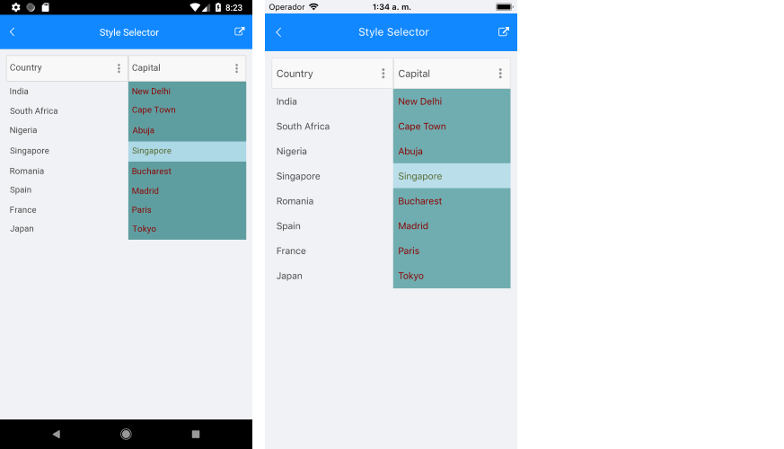

# Style Selectors

The DataGrid component exposes a conditional styling feature. It allows users to apply different styles on a cell or per group header depending on a specific condition.

You can set a different style on a specific cell from a specific column based on custom selection logic with the following properties:

* `CellContentStyleSelector`&mdash;Styles the content of the cell by using the text alignment options (`TextMargin`, `HorizontalTextAlignment`, `VerticalTextAlignment`), the font options (`FontAttributes`, `FontFamily`, `FontSize`) and the `TextColor` property.
* `CellDecorationStyleSelector`&mdash;Styles the decoration of a cell.

Different styles can be applied on a per-group header once the DataGrid control is grouped through `GroupHeaderStyleSelector` property.

Different styles can be applied on a per-group footer once the DataGrid control is grouped through `GroupFooterStyleSelector` property.

> To see the group footer the `ShowGroupFooters` property needs has to be `True`.

The `CellContentStyleSelector`, `CellDecorationStyleSelector`, and `GroupStyleSelector` use the `SelectStyle` method to change the style.

## Example

The following example will demonstrate how to apply the style selectors in the DataGrid control:

Let’s add the DataGrid and set the `CellContentStyleSelector` as a static resource of type `MyCellContentStyleSelector`, `CellDecorationStyleSelector` as a static resource of type `MyCellDecorationStyleSelector`, and `GroupStyleSelector` as a static resource of type `MyGroupStyleSelector`.

1. `DataGrid` definition in XAML:

 <snippet id='datagrid-styleselector-example'/>

1. Create a simple data for the DataGrid:

 <snippet id='datagrid-styleselector-data'/>

1. Set the `ItemsSource` of the `DataGrid` class:

  <snippet id='datagrid-styleselector-items'/>

1. Add `MyCellContentStyleSelector`, `MyCellDecorationStyleSelector`, and `MyGroupStyleSelector` as resources in the **Resource** page of the application:

 <snippet id='datagrid-styleselectors'/>

1. Create a custom class for each selector. This class derives from `DataGridStyleSelector` and overrides its `SelectStyle` method.

The `MyCellContentStyleSelector` class implementation is as follows:

 <snippet id='datagrid-styleselector-cellcontent'/>

The implementation of the `MyCellDecorationStyleSelector` class is shown below:

 <snippet id='datagrid-styleselector-celldecoration'/>

You can implement `MyGroupStyleSelector` as follows:

 <snippet id='datagrid-styleselector-group'/>

This is how the DataGrid control will look when `CellContentStyleSelector` is applied.

## See Also

- [DataGrid Styling]()
- [Columns Styling]()
