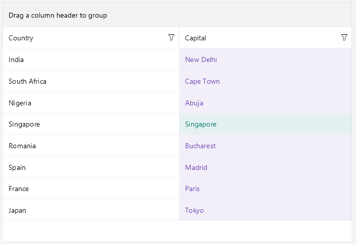

# .NET MAUI DataGrid Style Selectors

The [.NET MAUI DataGrid]() component exposes a conditional styling feature. It allows users to apply different styles on a cell or per group header depending on a specific condition.

## Cell Style Selector

You can set a distinct style to a specific cell in a given column based on custom style-selection logic with the following properties:

* `CellContentStyleSelector`(`IStyleSelector`)&mdash;Styles the content of the cell by using the text alignment options (`TextMargin`, `HorizontalTextAlignment`, `VerticalTextAlignment`), the font options (`FontAttributes`, `FontFamily`, `FontSize`) and the `TextColor` property.
* `CellDecorationStyleSelector`(`IStyleSelector`)&mdash;Styles the decoration of a cell.

> For the DataGrid Style Selector example, go to the [SDKBrowser Demo Application]() and navigate to the **DataGrid > Styling** category.

## Row Background Style Selector

You can set a different style on a row, an alternate row, and on row details based on custom style-selection logic by using the `RowBackgroundStyleSelector` (`IStyleSelector`) property.
To apply a `RowBackgroundStyleSelector` you have to:
1. Create a custom class that inherits from `IStyleSelector`. 
1. Implement the `SelectStyle` method.

The object item of the `SelectStyle` method is of type `DataGridRowInfo`. The `DataGridRowInfo` represents a class that provides information for each row in DataGrid and exposes the follwoing properties:
	
	* `Item` (`object`)&mdash;Gets the business object associated with the row.
	* `IsRowDetails` (`bool`)&mdash;Gets a value that specifies whether the row is RowDetail.
	* `IsAlternate` (`bool`)&mdash;Gets a value that specifies whether the row is an alternate one.

> For the DataGrid Row Background Style Selector example, go to the [SDKBrowser Demo Application]() and navigate to the **DataGrid > Styling** category.

## Group Style Selector

You can set a different style on a group header and footer based on custom style-selection logic with the following properties:

* `GroupHeaderStyleSelector`(`IStyleSelector`)&mdash;Specifies different style per-group header once the DataGrid control is grouped.
* `GroupFooterStyleSelector`(`IStyleSelector`)&mdash;Specifies different style per-group footer once the DataGrid control is grouped.

> To display the group footer, set the `ShowGroupFooters` property to `True`.

> For the DataGrid Style Selector example, go to the [SDKBrowser Demo Application]() and navigate to the **DataGrid > Styling** category.

The `CellContentStyleSelector`, `CellDecorationStyleSelector`, `RowBackgroundStyleSelector`, `GroupHeaderStyleSelectorand`, and `GroupFooterStyleSelector` use the `SelectStyle` method to change the style.

## Example with Cell and Group Style Selectors

The following example demonstrates how to apply the style selectors on the DataGrid cell and group header. You will add the DataGrid and set the `CellContentStyleSelector` property as a static resource of type `MyCellContentStyleSelector`, `CellDecorationStyleSelector` as a static resource of type `MyCellDecorationStyleSelector`, and `GroupStyleSelector` as a static resource of type `MyGroupStyleSelector`:

**1.** Define the `RadDataGrid` in XAML:

<snippet id='datagrid-styleselector-example'/>

**2.** Create a sample data model:

<snippet id='datagrid-styleselector-data'/>

**3.** Set the `ItemsSource` of the `RadDataGrid`:

<snippet id='datagrid-styleselector-items'/>

**4.** Create a custom class for each selector. Each class derives from `IStyleSelector` and overrides its `SelectStyle` method.

* The implementation of `MyCellContentSelector` class:

<snippet id='datagrid-styleselector-cellcontent'/>

* The implementation of `MyCellDecorationSelector` class:

<snippet id='datagrid-styleselector-celldecoration'/>

* The implementation of `MyGroupSelector` class:

<snippet id='datagrid-styleselector-group'/>

**5.** Add `MyCellContentSelector`, `MyCellDecorationSelector`, and `MyGroupSelector` as resources in the **Resource** page of the application:

<snippet id='datagrid-styleselectors'/>

This is how the DataGrid control will look when `CellContentStyleSelector` is applied.

> For the DataGrid Style Selector example, go to the [SDKBrowser Demo Application]() and navigate to the **DataGrid > Styling** category.

## Example with Row Background Style Selectors

The following example demonstrates how to apply the style selectors on the DataGrid rows, row details, and alternate rows. You will add the DataGrid and set the `RowBackgroundStyleSelector` property as a static resource of type `MyRowBackgroundStyleSelector`:

**1.** Define the `RadDataGrid` in XAML:

<snippet id='datagrid-rowbackground-styleselector-example'/>

**2.** Create a sample data model:

<snippet id='datagrid-rowbackground-styleselector-model'/>

**3.** Define the `ViewModel`:

<snippet id='datagrid-rowbackground-styleselector-viewmodel'/>

**4.** Create a custom class `MyRowBackgroundStyleSelector` that derives from `IStyleSelector` and override the `SelectStyle` method.

<snippet id='datagrid-rowbackground-styleselector-class'/>

**5.** Add `MyRowBackgroundStyleSelector` as resource in the **Resource** page of the application:

<snippet id='datagrid-rowbackground-styleselector'/>

This is how the DataGrid control looks when applying the `RowBackgroundStyleSelector`.

> For the DataGrid Row Background Style Selector example, go to the [SDKBrowser Demo Application]() and navigate to the **DataGrid > Styling** category.

## See Also

- [DataGrid Styling]()
- [Columns Styling]()
