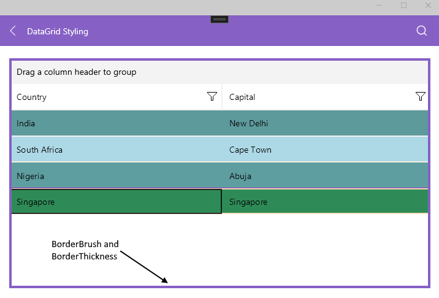
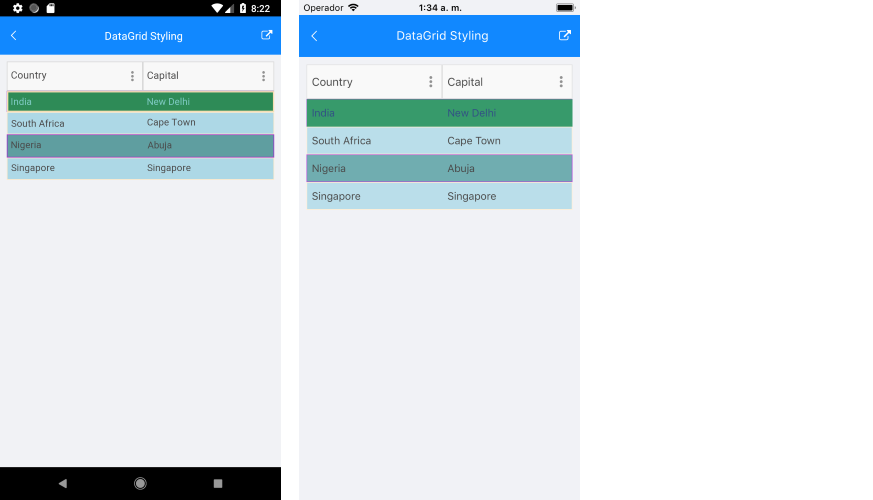

# .NET MAUI DataGrid Styling

The DataGrid control provides the following `Style` properties for customizing its look & feel:

* `BorderBrush`&mdash;Defines the brush of the border placed around the DataGrid control.
* `BorderThickness`&mdash;Defines the thickness of the border around the DataGrid control.
* `RowBackgroundStyle`&mdash;Defines the style of each row.
* `AlternateRowBackgroundStyle`&mdash;Defines the appearance style of an alternated row.
* `GroupHeaderStyle`&mdash;Defines the appearance style of the group header once the DataGrid is grouped.
* `SelectionStyle`&mdash;Defines the appearance settings applied to the selected DataGrid row.
* `CurrentCellStyle`&mdash;Defines the style applied to the current cell.
* `HoverTextColor`&mdash;Defines the text color of the hovered cell.
* `MouseHoverStyle`&mdash;Specifies the style applied to the cells and rows when the mouse is over them. The style is applicable for Desktop(MacCatalyst and WinUI).
* `FrozenColumnsSplitterStyle`(`Telerik.Maui.Controls.Compatibility.DataGrid.DataGridFrozenColumnsSplitterStyle`) property allows you to style the splitter UI. The Splitter UI splits the frozen columns from the unfrozen columns.
* `GridLinesVisibility`(`Telerik.Maui.Controls.Compatibility.DataGrid.GridLinesVisibility`) property defines which grid lines are currently visible (displayed). The property can be set to `Both`, `Horizontal`, `None` and `Vertical`.
* `GridLinesColor`&mdash;Defines the appearance of the grid's horizontal and vertical lines.
`GridLinesThickness`&mdash;Defines the width of the vertical grid lines and the height of the horizontal grid lines.



The `BorderBrush` and `BorderThickness` properties set to the DataGrid control below:
```XAML
 <telerik:RadDataGrid x:Name="DataGrid" 
                      BorderBrush="#8660C5" 
                      BorderThickness="4"/>
```

## Styling Properties

`RowBackgroundStyle`, `AlternateRowBackgroundStyle`, `SelectionStyle`, `CurrentCellStyle` and `MouseHoverStyle` are of type `DataGridBorderStyle` that defines the appearance settings applied to a `BorderPaintable` instance and exposes the `BackgroundColor`, `BorderColor`, and `BorderTickness` properties.

Example how to set the `RowBackgroundStyle` property:

<snippet id='datagrid-styling-rowbackgroundstyle'/>

Example how to set the `AlternateRowBackgroundStyle` is shown below:

<snippet id='datagrid-styling-alternaterowbackgroundstyle'/>

The `SelectionStyle` property can be set as shown below:

<snippet id='datagrid-styling-selectionstyle'/>

The `CurrentCellStyle` property can be set as shown below:

<snippet id='datagrid-keyboard-navigation-style' />

The `HoverTextColor` property can be set as shown below:

```XAML
<telerik:DataGridTextColumn PropertyName="Name" 
                            HeaderText="Name">
    <telerik:DataGridTextColumn.CellContentStyle>
        <telerik:DataGridTextCellStyle TextColor="Green" 
                                        HoverTextColor="Red"
                                        FontSize="15" 
                                        SelectedTextColor="Orange"  />   
    </telerik:DataGridTextColumn.CellContentStyle>
</telerik:DataGridTextColumn>
```

The `GridLinesVisibility` property can be set as shown below:

```XAML
 <telerik:RadDataGrid GridLinesVisibility="Both"
                             Grid.Row="2"
                             Grid.ColumnSpan="3" 
                             ItemsSource="{Binding GridSource}" 
                             GridLinesColor="Red" 
                             GridLinesThickness="5" />
```

The `GoupHeaderStyle` property is applied once the DataGrid is grouped.

The following properties can be used for customizing the grouped DataGrid:

* `BackgroundColor`&mdash;Defines the color that fills the area within the header of the DataGrid `GroupHeader`.
* `BorderColor`&mdash;Defines the color that fills the border region of the `GroupHeader`.
* `BorderThickness`&mdash;Defines the thickness of the border.
* `Button Font Options` (`ButtonFontAttributes`, `ButtonFontFamily`, `ButtonFontSize`)&mdash;Define the font options of the `GroupedHeader` expand/collapse symbol.
* `ButtonMargin`&mdash;Defines the margin of the expand/collapse symbol of the `GroupHeader`.
* `ButtonTextColor`&mdash;Defines the text color of the expand/collapse symbol of the `GroupHeader`.
* `CollapseButtonText`&mdash;Defines the text for the collapse state of the `GroupHeader`.
* `ExpandButtonText`&mdash;Defines the text for the expand state of the `GroupHeader`.
* `Text` alignment options (`TextMargin`, `VerticalTextAlignment`, `HorizontalTextAlignment`)&mdash;Define the positioning for the text part of the `GroupHeader`.
* `TextFont` options (`TextFontattributes`, `TextFontFamily`, `TextFontSize`)&mdash;Define the font options of the `GroupHeaders` text part.

>note Note that once the group is applied to the DataGrid, the `GroupHeader` will appear. Also, by default, the Button of the `GroupHeader` uses an internal symbol font family. To show text when the button is expanded or collapsed, instead of a symbol set a font family to the `ButtonFontFamily` property and define text to the `ExpandButtonText` and `CollapseButtonText` properties. For more details, refer to the [group feature of the DataGrid]().

Example how to apply the `GoupHeaderStyle` property to the DataGrid control:

<snippet id='datagrid-styling-groupheaderstyle'/>

Here is how the DataGrid looks:



**Splitter UI Style**

Style the Splitter UI using the following properties&mdash;`Width`, `BackgroundColor`, `BorderColor` and `BorderThickness`.

```XAML
<telerik:RadDataGrid.FrozenColumnsSplitterStyle>
    <telerik:DataGridFrozenColumnsSplitterStyle Width="20"
                                                BorderColor="Gray"
                                                BorderThickness="2"
                                                BackgroundColor="LightBlue"/>
</telerik:RadDataGrid.FrozenColumnsSplitterStyle>
```

## See Also

- [Columns Styling]()
- [Style Selectors]()
