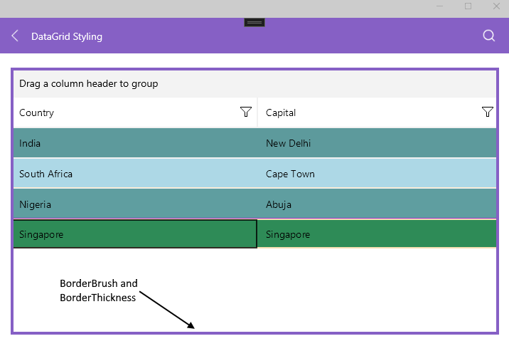
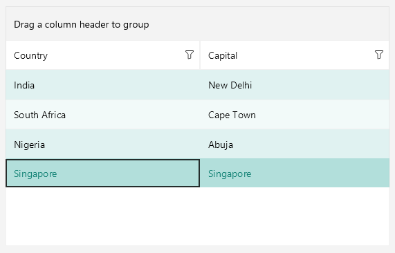

# Style the .NET MAUI DataGrid

Use the [.NET MAUI DataGrid]() styling properties to control the appearance of borders, rows, cells, grid lines, and the frozen columns splitter. This article helps you choose the correct styling surface for each area of the DataGrid and shows the most common properties for each task.

## What Can You Style in the DataGrid

Use the following styling areas depending on the part of the DataGrid that you want to customize:

| Area | Main Properties | Use It When |
|---|---|---|
| Border | `BorderBrush`, `BorderThickness` | You want to change the outer frame of the DataGrid. |
| Rows and cells | `RowBackgroundStyle`, `AlternateRowBackgroundStyle`, `SelectionStyle`, `CurrentCellStyle`, `MouseHoverStyle` | You want to change row fills, selection state, the current cell, or desktop hover behavior. |
| Grid lines | `GridLinesVisibility`, `GridLinesColor`, `GridLinesThickness` | You want to control the separator lines between rows and columns. |
| Frozen columns splitter | `FrozenColumnsSplitterStyle` | You want to style the divider between frozen and scrollable columns. |

## Border Brush and Thickness

Use `BorderBrush` and `BorderThickness` when you want to emphasize the outer boundary of the DataGrid:

- `BorderBrush` defines the brush of the border around the DataGrid.
- `BorderThickness` defines the thickness of that border.

The following example sets both properties:

```xaml
<telerik:RadDataGrid x:Name="DataGrid"
					 BorderBrush="#8660C5"
					 BorderThickness="4" />
```

The following image shows a styled DataGrid border:



## Cells and Rows

Use the following properties to style row backgrounds, selection state, the current cell, and hover behavior:

- `RowBackgroundStyle` of type `Style` with target type `DataGridRowBackgroundAppearance` defines the style of each row.
- `AlternateRowBackgroundStyle` of type `Style` with target type `DataGridRowBackgroundAppearance` defines the style of alternating rows.
- `SelectionStyle` of type `Style` with target type `DataGridSelectionAppearance` defines the appearance of the selected row.
- `CurrentCellStyle` of type `Style` with target type `DataGridCurrentCellAppearance` defines the style of the current cell.
- `MouseHoverStyle` of type `Style` with target type `DataGridMouseHoverAppearance` defines the style applied to rows and cells when the pointer moves over them on desktop platforms.

These appearance types derive from `DataGridBorderAppearance`, which exposes `BackgroundColor`, `SearchMatchBackgroundColor`, `BorderColor`, and `BorderThickness`.

Use `RowBackgroundStyle` to define the default row appearance:

<snippet id='datagrid-styling-rowbackgroundstyle'/>

Use `AlternateRowBackgroundStyle` when you want zebra-striping for easier scanning:

<snippet id='datagrid-styling-alternaterowbackgroundstyle'/>

Use `SelectionStyle` to make the selected row more visible:

<snippet id='datagrid-styling-selectionstyle'/>

For details about styling the current cell through `CurrentCellStyle`, see [Style the current DataGrid cell](#styling-the-cell).

The following image shows styled rows and selection state:



## Lines

Use the following properties to control the grid lines between rows and columns:

- `GridLinesVisibility` of type `Telerik.Maui.Controls.DataGrid.GridLinesVisibility` defines which DataGrid lines are visible. The supported values are `Both`, `Horizontal`, `None`, and `Vertical`.
- `GridLinesColor` defines the color of the horizontal and vertical grid lines.
- `GridLinesThickness` defines the width of the vertical lines and the height of the horizontal lines.

The following example shows how to display and style the grid lines:

```XAML
<telerik:RadDataGrid x:Name="dataGrid"
					 ItemsSource="{Binding GridSource}"
					 GridLinesVisibility="Both"
					 GridLinesThickness="5" />
```

## Frozen Columns

When your DataGrid uses frozen columns, `FrozenColumnsSplitterStyle` lets you style the divider between the frozen and scrollable column areas.

## Splitter UI

Use the `Width`, `BackgroundColor`, `BorderColor`, and `BorderThickness` properties to change the appearance of the splitter:

```xaml
<telerik:RadDataGrid.FrozenColumnsSplitterStyle>
	<Style TargetType="telerik:DataGridFrozenColumnsSplitterAppearance">
		<Setter Property="Width" Value="20" />
		<Setter Property="BorderColor" Value="Gray" />
		<Setter Property="BorderThickness" Value="2" />
		<Setter Property="BackgroundColor" Value="LightBlue" />
	</Style>
</telerik:RadDataGrid.FrozenColumnsSplitterStyle>
```

Use this style when the default splitter is too subtle or when you want the frozen columns area to stand out more clearly.

## See Also

- [Styling the .NET MAUI DataGrid Columns]()
- [Available DataGrid Style Selectors]()
