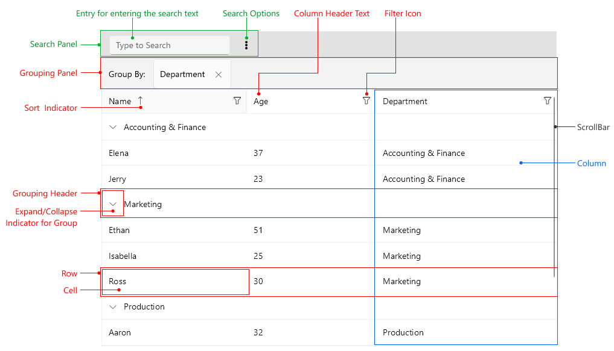

# .NET MAUI DataGrid Visual Structure

The visual structure of the .NET MAUI DataGrid represents the anatomy of the UI control. Being familiar with the visual elements of the DataGrid allows you to quickly find the information required to configure them.

The following image shows the anatomy of the DataGrid.

## Displayed Elements

- **Grouping Panel**&mdash;Represents the group area that holds the properties the DataGrid is grouped by. 
- **Search Panel**&mdash;Represents the area with all search related elements as follow:
	- **Entry for entering the search text**&mdash;Represents an entry control where the end user can enter the search term.
	- **Search Options** to choose from, such as whether to match the case, or whether to filter the results.
- **Filter Icons**&mdash;Represents an icon that allows opening the filtering UI.
- **Sort Icon**&mdash;Represents an icon which displays when tapping on the column header. The icon direction points whether the order of the sorting is ascending or descending.
- **Row**&mdash;Represents the row of the DataGrid.
- **Cell**&mdash;Represents the cell of the DataGrid.
- **Group Header**&mdash;Represents the elements inside the group area&mdash;the group header and group expand or collapse indicator.
- **Expand/Collapse Indicator for Group**&mdash;Represents the expand or collapse indicator which indicates whether the group is expanded or collapsed.
- **Column**&mdash;Represents the column in the DataGrid.
- **Column Header Text**&mdash;Represents the header text in the column.
- **ScrollBar**&mdash;Represents the ScrollBar.