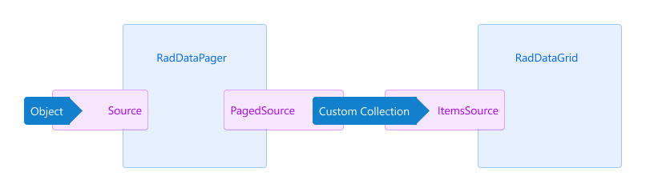

# .NET MAUI DataPager Data Source Binding

The Telerik UI for .NET MAUI DataPager can page any collection that implements the `IEnumerable` interface. 

To bind the desired collection to the DataPager, pass the collection to the DataPager's `Source` (`object`) property.  This will split the data into pages.

The following demonstrates how to use the `Source` property to bind a collection:

**1.** Define the DataPager in XAML:

<snippet id='datapager-getting-started-xaml' />

**2.** Add a sample `ViewModel`:

<snippet id='datapager-features-viewmodel' />

**3.** Set the `ViewModel` as a `BindingContext`:

```C#
this.BindingContext = new ViewModel();
```

## Binding to the PagedSource Property of the RadDataPager

Often, your collection will be a simple `List`, an `ObservableCollection`, or a collection that inherits from `IEnumerable`. Unless you had paging in mind when you designed your project, it is almost certain that your data source will not be pageable out of the box. In these scenarios, bind to the `PagedSource` (`IEnumerable`) property of the `RadDataPager`.



The image above illustrates the process for binding to the `PagedSource` property of the DataPager:

1. You assign an `object` to the `Source` of a `RadDataPager`.
1. The `RadDataPager` wraps the `Source` in a custom collection.
1. The `Source` is exposed through the `RadDataPager.PagedSource` property.
1. Attach an item control to the `PagedSource` property and the control will be paged automatically.

Review the [Integration with DataGrid]() and [Integration with CollectionView]() articles, for more details how to use the `PagedSource` property.

## See Also

- [Display Modes]()
- [Ellipsis Modes]()
- [Page Configuration]()
- [Localization]()
- [Commands in DataPager]()
- [Styling]()
- [Integration with DataGrid]()
