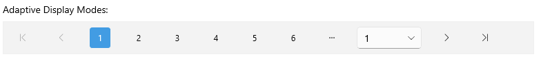

# .NET MAUI DataPager Display Mode

The DataPager lets you control the visibility of its visual elements. In addition, you can use Adaptive Display modes to arrange the pager's elements.

To set the visibility of the DataPager's elements, use the `DisplayMode` (`enum` of type `Telerik.Maui.Controls.DataPager.DataPagerDisplayMode`) property. The available options for `DisplayMode` are:

* `None`&mdash;Displays no elements in the DataPager.
* `FirstPageButton`&mdash;Displays the first page button.
* `PrevPageButton`&mdash;Displays the previous page button.
* `NumericButtons`&mdash;Displays the numeric buttons.
* `NavigationComboBox`&mdash;Displays the navigation ComboBox.
* `NextPageButton`&mdash;Displays the next page button.
* `LastPageButton`&mdash;Displays the last page button.
* `PageSizesView`&mdash;Displays the `PageSizes` view.
* `NavigationView`&mdash;Displays the navigation view.

The following example demonstrates how to use the  `DisplayMode` property:

**1.** Define the DataPager in XAML:

<snippet id='datapager-display-mode' />

**2.** Add the `telerik` namespace:

```XAML
xmlns:telerik="http://schemas.telerik.com/2022/xaml/maui"
```

**3.** Define the `ViewModel`:

<snippet id='datapager-features-viewmodel' />

This is the result on desktop:


> For the DataPager Display Mode example, go to the [SDKBrowser Demo Application]() and navigate to the **DataPager > Features** category.

## Adaptive Display Modes

The DataPager lets you customize the default arrangement of the elements in the pager by providing the `AdaptiveDisplayModes` property:

* `AdaptiveDisplayModes` (`IList<DataPagerDisplayMode>`)&mdash;Specifies a list of element combinations that will be displayed.

The following example demonstrates how to use the  `AdaptiveDisplayModes` property:

**1.** Define the DataPager in XAML:

<snippet id='datapager-adaptivedisplay-mode' />

**2.** Add the following namespace:

```XAML
xmlns:telerik="http://schemas.telerik.com/2022/xaml/maui"
```

**3.** Define the `ViewModel`:

<snippet id='datapager-features-viewmodel' />

This is the result on desktop:



> For the DataPager Display Mode example, go to the [SDKBrowser Demo Application]() and navigate to the **DataPager > Features** category.

## Additional Resources

- [.NET MAUI DataPager Product Page](https://www.telerik.com/maui-ui/datagrid)
- [.NET MAUI DataPager Forum Page](https://www.telerik.com/forums/maui?tagId=1801)
- [Telerik .NET MAUI Blogs](https://www.telerik.com/blogs/mobile-net-maui)
- [Telerik .NET MAUI Roadmap](https://www.telerik.com/support/whats-new/maui-ui/roadmap)

## See Also

- [Paged Source]()
- [Ellipsis Modes]()
- [Page Configuration]()
- [Localization]()
- [Commands in DataPager]()
- [Styling]()
- [Integration with DataGrid]()