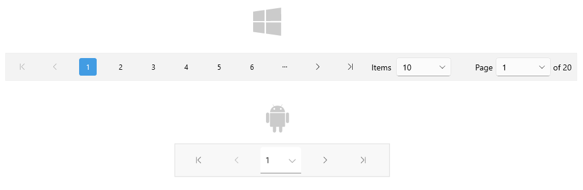

# Getting Started with the .NET MAUI DataPager

This guide provides the information you need to start using the [Telerik UI for .NET MAUI DataPager]() by adding the control to your project.

At the end, you will achieve the following result.



## Prerequisites

Before adding the DataPager, you need to:

1. [Set up your .NET MAUI application](#step-1-set-up-your-net-maui-application).

1. [Download Telerik UI for .NET MAUI](#step-2-download-telerik-ui-for-net-maui).

1. [Install Telerik UI for .NET MAUI](#step-3-install-telerik-ui-for-net-maui).

## Define the Control

**1.** When your .NET MAUI application is set up, you are ready to add a DataPager control to your page.

```XAML
<telerik:RadDataPager x:Name="dataPager"/>
```
<snippet id='datapager-gettingstarted-csharp' />

**2.** Add the `telerik` namespace:

```XAML
xmlns:telerik="http://schemas.telerik.com/2022/xaml/maui"
```
```C#
using Telerik.Maui.Controls;
```

**3.** Register the Telerik controls through the `Telerik.Maui.Controls.Compatibility.UseTelerik` extension method called inside the `CreateMauiApp` method of the `MauiProgram.cs` file of your project:

```C#
using Telerik.Maui.Controls.Compatibility;

public static class MauiProgram
{
	public static MauiApp CreateMauiApp()
	{
		var builder = MauiApp.CreateBuilder();
		builder
			.UseTelerik()
			.UseMauiApp<App>()
			.ConfigureFonts(fonts =>
			{
				fonts.AddFont("OpenSans-Regular.ttf", "OpenSansRegular");
			});

		return builder.Build();
	}
}
```

## Add Source

To visualize the pages, bind a collection to the `Source` property of the DataPager control.

**1.** Define the DataPager in XAML or C#:

<snippet id='datapager-getting-started-xaml' />
<snippet id='datapager-gettingstarted-csharp' />

**2.** Define the `ViewModel`:

<snippet id='datapager-features-viewmodel' />

**3.** Set the `ViewModel` as a `BindingContext`:

```C#
this.BindingContext = new ViewModel();
```

> For the DataPager Getting Started example, go to the [SDKBrowser Demo Application]() and navigate to the **DataPager > Getting Started** category.

## Additional Resources

- [Paged Source]()
- [Display Modes]()
- [Ellipsis Modes]()
- [Page Configuration]()
- [Localization]()
- [Commands in DataPager]()
- [Styling]()
- [Integration with DataGrid]()

## See Also

- [.NET MAUI DataPager Product Page](https://www.telerik.com/maui-ui/datapager)
- [.NET MAUI DataPager Forum Page](https://www.telerik.com/forums/maui?tagId=1801)
- [Telerik .NET MAUI Blogs](https://www.telerik.com/blogs/mobile-net-maui)
- [Telerik .NET MAUI Roadmap](https://www.telerik.com/support/whats-new/maui-ui/roadmap)
