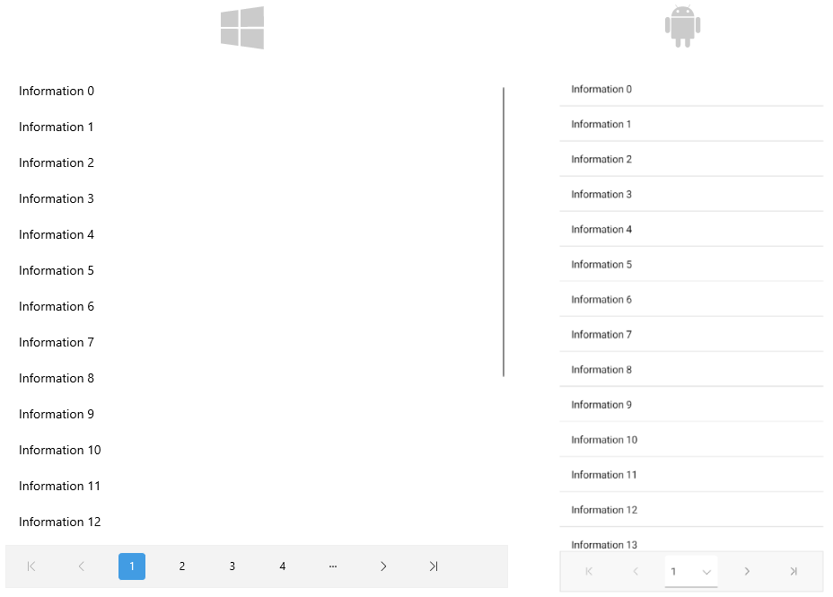

# .NET MAUI DataPager Integration with CollectionView

You can page the data of the [Telerik UI for .NET MAUI CollectionView]() by using the DataPager control. However, the DataPager is independent of the CollectionView, and you can use it with any other `ItemsControl`.



>Currently, the DataPager does not support the Telerik UI for .NET MAUI CollectionView [`LoadOnDemandCollection`]().

## Example

Here is an example of how to use the DataPager with the CollectionView control.

**1.** Define the DataPager and the DataPager in XAML:

<snippet id='radcollectionview-datapager' />

**2.** Add the following namespace:

```XAML
xmlns:telerik="http://schemas.telerik.com/2022/xaml/maui"
```

**3.** Define the `ViewModel`:

<snippet id='datapager-viewmodel' />

**4.** Define sample data:

<snippet id='datapager-data' />

> For the DataPager Integration with CollectionView example, go to the [SDKBrowser Demo Application]() and navigate to the **DataPager > Integration** category.
> For the DataPager Integration with Microsoft MAUI CollectionView example, go to the [SDKBrowser Demo Application]() and navigate to the **DataPager > Integration** category.

## See Also

- [Paged Source]()
- [Display Modes]()
- [Ellipsis Modes]()
- [Page Configuration]()
- [Localization]()
- [Commands in DataPager]()
- [Styling]()
