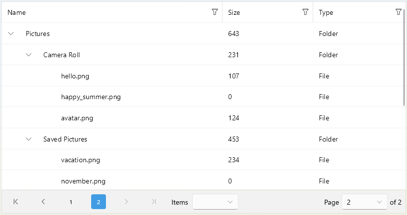

# .NET MAUI DataPager Integration with TreeDataGrid

You can page the data of the [Telerik UI for .NET MAUI TreeDataGrid]() by using the DataPager control.



>Currently, the DataPager does not support the Telerik UI for .NET MAUI TreeDataGrid [`LoadOnDemandCollection`](#loadOnDemand-collection).

## Example

Here is an example of how to use the DataPager with the TreeDataGrid control.

**1.** Define the DataPager and the TreeDataGrid in XAML:

<snippet id='treedatagrid-datapager' />

**2.** Add the following namespace:

```XAML
xmlns:telerik="http://schemas.telerik.com/2022/xaml/maui"
```

**3.** Create a sample `Data` class:

<snippet id='treedatagrid-data-model' />

**4.** Add the `ViewModel` class:

<snippet id='treedatagrid-viewmodel' />

> For the DataPager Integration with TreeDataGrid example, go to the [SDKBrowser Demo Application]() and navigate to the **DataPager > Integration** category.

## See Also

- [Paged Source]()
- [Display Modes]()
- [Ellipsis Modes]()
- [Page Configuration]()
- [Localization]()
- [Commands in DataPager]()
- [Styling]()
