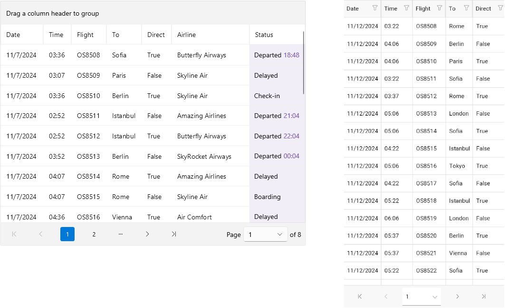

# .NET MAUI DataPager Overview

The Telerik UI for .NET MAUI DataPager provides users with a navigation interface for paging through any data collection. It supplies a paged data source to data-bound controls and is particularly useful when working with large datasets.

## .NET MAUI DataPager Key Features

* [Data Binding]()&mdash;You can bind the DataPager to any collection that implements the `IEnumerable` interface, making it suitable for paging any collection.
* [Display modes]()&mdash;You can use different modes to define which of the visual elements in the DataPager will be visible, for example, the first/last/next page buttons and more.
* [Ellipsis modes]()&mdash;You can specify where the three dots appear in the DataPager.
* [Page size](#page-size)&mdash;You can use different properties to configure the page, like setting the page size, current page index, and more.
* [Define the number of the page buttons](#page-number-range)&mdash;You can specify the minimum and maximum number of the numeric (page number) buttons in the DataPager control.
* [Item spacing](#item-spacing)&mdash;You can specify the space between the items in the DataPager.
* [Localization]()&mdash;Translate the phrases used across the DataPager control to other languages so that you can adapt your app to different regions.
* [Commands]()&mdash;The Telerik UI for .NET MAUI DataPager exposes a number of commands that will be executed when the users click the navigation buttons.
* [Flexible Styling API]()&mdash;Thanks to the control's flexible API, you can directly configure how various elements of the Telerik UI for .NET MAUI DataPager are displayed in your application, change the look of the buttons, navigation area, and more.

## Next Steps

- [Getting Started with Telerik UI for .NET MAUI DataPager]()

## See Also

- [.NET MAUI DataPager Product Page](https://www.telerik.com/maui-ui/datapager)
- [.NET MAUI DataPager Forum Page](https://www.telerik.com/forums/maui?tagId=1801)
- [Telerik .NET MAUI Blogs](https://www.telerik.com/blogs/mobile-net-maui)
- [Telerik .NET MAUI Roadmap](https://www.telerik.com/support/whats-new/maui-ui/roadmap)
