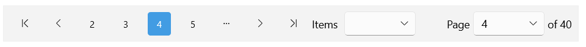

# .NET MAUI DataPager Page Configuration

This article explains the configuration options you can apply to the pages inside the DataPager control.

## Page Size

The DataPager splits the data into separate pages with a certain size. To configure the size of the pages in the DataPager, use the following properties:

* `PageSize` (`int`)&mdash;Specifies the number of the items per page. The default value is `10`.

* `PageSizes` (`IList<int>`)&mdash;Specifies a list with page sizes the end user can choose from. The default values in the list are `5, 10, 20, 50`.

## Current Page

The DataPager manages the current page depending on the user's actions. In addition, you can specify the current index of the DataPager by using the `PageIndex` (`int`) property.
The property contains the index of the currently selected page. The default value is `-1`.

## Page Number Range

By setting a range, you can define how many numeric buttons the DataPager will render.

To implement a page number range, use the following DataPager properties:

* `MinNumericButtonsCount` (`int`)&mdash;Specifies the minimum number of numeric buttons.
* `MaxNumericButtonsCount` (`int`)&mdash;Specifies the maximum number of numeric buttons.

## Item Spacing

You can specify the space between the items in the DataPager by setting the `ItemSpacing` (`double`) property. The default value is `16`.

## Example

Here is an example with the `PageSize`, `PageIndex`, `PageSizes`, and `ItemSpacing` properties.

**1.** Define the DataPager in XAML:

<snippet id='datapager-page-configuration' />

**2.** Add the `telerik` namespace:

```XAML
xmlns:telerik="http://schemas.telerik.com/2022/xaml/maui"
```

**3.** Define the `ViewModel`:

<snippet id='datapager-features-viewmodel' />

This is the result on WinUI:



> For the DataPager Page configuration example, go to the [SDKBrowser Demo Application]() and navigate to the **DataPager > Features** category.

## See Also

- [Paged Source]()
- [Display Modes]()
- [Ellipsis Modes]()
- [Localization]()
- [Commands in DataPager]()
- [Styling]()
- [Integration with DataGrid]()