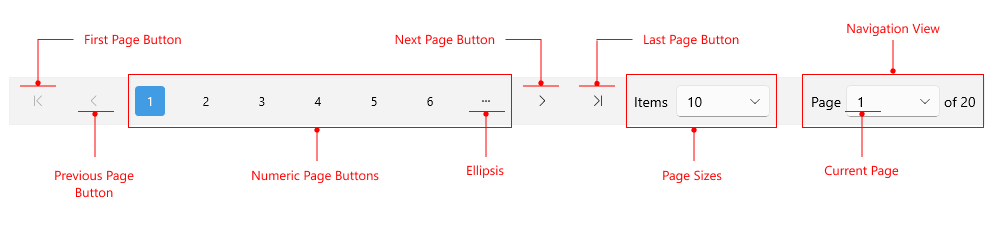

# .NET MAUI DataPager Visual Structure

The visual structure of the .NET MAUI DataPager represents the anatomy of the UI component. Being familiar with the visual elements of the DataPager allows you to quickly find the information required to configure them.

The following image shows the anatomy of the DataPager.

## Displayed Elements

- `First Page Button`&mdash;Represents the first page button. This button brings the pager on the first page of data.
- `Previous Page Button`&mdash;Represents the previous page button. This button decrements the DataPager's current page index and brings it on the previous page of data.
- `Numeric Page Buttons`&mdash;Represents a set of buttons that lists the available pages and allows the user to go directly to the desired one.
- `Ellipsis`&mdash;The first and the last numeric buttons can display ellipsis instead of numbers when the pages are more than the rendered numeric buttons.
- `Next Page Button`&mdash;Represents the next page button. This button increments the DataPager's current page index and brings it on the next page of data.
- `Last Page Button`&mdash;Represents the last page button. This button brings the DataPager on the last page of data.
- `Page Sizes`&mdash;This area represents the available page sizes (items per page) that the end-user can choose from.
- `Current Page`&mdash;Indicates the current page.
- `Navigation View`&mdash;This area allows the user to see the current page and the total count of pages. It also allows the user to select the desired page and navigate directly to it.

The elements are visualized based on the available space. For example, if the user starts resizing the screen to reduce/exceed the DataPager's width, the elements inside the DataPager will be removed/added. 

The image below is from android device and it shows the elements displayed in the DataPager based on the availabe space. 
The displayed elements are the `First Page Button`, `Previous Page Button`, `NavigationComboBox` , `Next Page Button` and `Last Page Button`.

## See Also

- [.NET MAUI DataPager Product Page](https://www.telerik.com/maui-ui/datapager)
- [.NET MAUI DataPager Forum Page](https://www.telerik.com/forums/maui?tagId=2057)
- [Telerik .NET MAUI Blogs](https://www.telerik.com/blogs/mobile-net-maui)
- [Telerik .NET MAUI Roadmap](https://www.telerik.com/support/whats-new/maui-ui/roadmap)