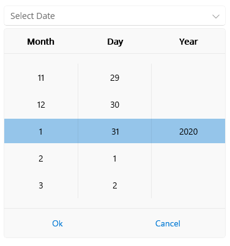

# Date Ranges in .NET MAUI DatePicker

Use the Telerik UI for .NET MAUI DatePicker date-range settings when you want users to select a date only within a specific period. This is useful for scenarios such as booking windows, reporting periods, or restricting the control to valid business dates.

Use the following DatePicker properties to define the available date range:

- `MinimumDate` (`DateTime`)&mdash;Defines the first available date in the range. The default value is `DateTime(2000, 1, 1)`.
- `MaximumDate` (`DateTime`)&mdash;Defines the last available date in the range. The default value is `DateTime(2099, 12, 31, 23, 59, 59)`.

Use a date range when you want to:

- Limit the available dates to a known time period.
- Prevent users from selecting dates outside a business rule.
- Guide users to a valid start and end period for data entry.

## Example with Date Range

The following example defines a DatePicker that allows selection only within the 2020 calendar year.

1. Define the DatePicker and set `MinimumDate` and `MaximumDate`:

```xaml
<telerik:RadDatePicker MinimumDate="2020,1,1"
                       MaximumDate="2020,12,31"
                       DisplayStringFormat="yyy-ddd-MMM" />
```

2. Add the `telerik` namespace if it is not already declared in your XAML page:

```xaml
xmlns:telerik="http://schemas.telerik.com/2022/xaml/maui"
```

In this configuration:

- `MinimumDate` allows dates starting from January 1, 2020.
- `MaximumDate` allows dates up to December 31, 2020.
- `DisplayStringFormat` controls how the selected date is displayed in the input area.

The following image shows the result:



## See Also

- [Formatting the Telerik UI for .NET MAUI DatePicker]()
- [.NET MAUI DatePicker Templates]()
- [.NET MAUI DatePicker Selection]()
- [.NET MAUI DatePicker Styling]()
- [.NET MAUI DatePicker Product Page](https://www.telerik.com/maui-ui/datepicker)
