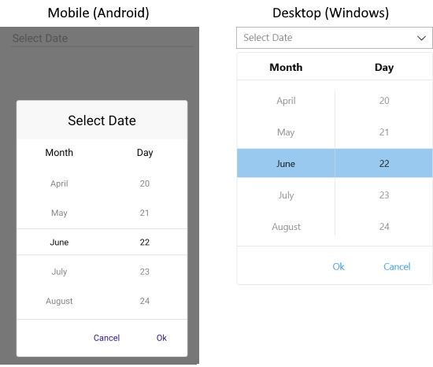
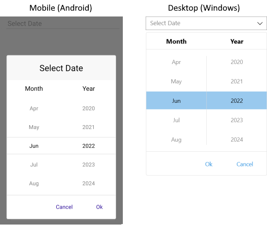
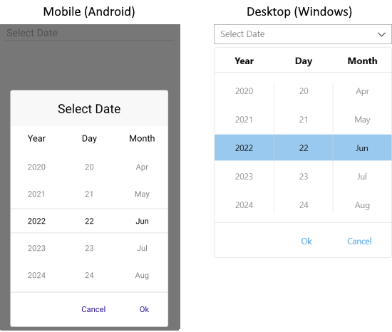

# Formatting

Telerik UI for .NET MAUI DatePicker provides formatting options both when the picker dialog is open and when a date value is picked.

## DisplayString Format

The `DisplayStringFormat` property defines the format of the string that will be visualized when the picker dialog is closed.

>note The format set for `DisplayStringFormat` has to be a valid date format.

The following example demonstrates how to set the `DisplayStringFormat` definition.

1. Define the control and the `DisplayStringFormat`.

 <snippet id='datepicker-keyfeatures-date-defaulthighlighted' />
 ```XAML
<telerikInput:RadDatePicker DefaultHighlightedDate="2020,05,15"
                            DisplayStringFormat="yyyy/MMM/dd"
                            Placeholder="Pick a date!"
                            SpinnerFormat="dd/MMM/yyyy"
                            AreSpinnerHeadersVisible="False"/>
 ```

1. Add the following namespace:

 ```XAML
xmlns:telerikInput="clr-namespace:Telerik.XamarinForms.Input;assembly=Telerik.Maui.Controls.Compatibility"
 ```

## Spinner Format

The DatePicker allows you to use standard or custom date format strings through its `SpinnerFormat` property. Depending on what format is set, the picker visualizes spinner controls with prepopulated values that can be picked.

The `SpinnerFormat` property defines the string format for the spinners. The default format is `"g"`.

## Standard Date Format Strings

The available Standard Date Format Strings, which can be set to the `SpinnerFormat` and `DisplayStringFormat` properties, are described in the following table.

| Supported Standard Date Format String | Description |
| -------- | -------- |
| `"d"` | A Short Date Format. The invariant culture format is `MM/dd/yyyy`. |
| `"G"` | A Short Date `"d"` and Long Time `"T"` specifier. |
| `"g"` | A Short Date `"d"` and Short Time `"t"` specifier. |
| `"M"` | A Month Format specifier. |
| `"m"` | A Month Format specifier. |
| `"Y"` | A Year Month Format specifier. |
| `"y"` | A Year Month Format specifier. |

## Custom Date Format Strings

The available Custom Date Format Strings, which can be set to the `SpinnerFormat` and `DisplayStringFormat` properties, are described in the following table.

| Supported Custom Date Format Strings|
| -------- |
| `"d"` |
| `"dd"` |
| `"M"` |
| `"MM"` |
| `"MMM"` |
| `"MMMM"` |
| `"y"` |
| `"yyy"` |
| `"yyyy"` |

>important Currently, the DatePicker does not support any standard date formats, which contain a long date inside them. For more information, refer to the official Microsoft documentation on [Standard Date Format Strings](https://docs.microsoft.com/en-us/dotnet/standard/base-types/standard-date-and-time-format-strings).

## Supported Separators

When `SpinnerFormat` is set and the device culture is changed, the separators used for the format string won't be changed:

| Supported Format Separators |
| -------- |
| `"-"` |
| `"."` |
| `","` |
| `" "` |
| `":"` |
| `"/"` |

## Examples

The following examples demonstrate how to set the `SpinnerFormat` property of the DatePicker to different formats.

### SpinnerFormat="MMMM dd"

The following example demonstrates how to set the `SpinnerFormat` property to the `"MMMM dd"` format.

```XAML
<telerikInput:RadDatePicker SpinnerFormat="MMMM dd" />
```


The following image shows the result:



### SpinnerFormat="dd"

The following example demonstrates how to set the `SpinnerFormat` property to the `"dd"` format.

```XAML
<telerikInput:RadDatePicker SpinnerFormat="dd" />
```


The following image shows the result:


### SpinnerFormat="MMM yyyy"

The following example demonstrates how to set the `SpinnerFormat` property to the `"MM yyyy"` format.

```XAML
<telerikInput:RadDatePicker SpinnerFormat="MMM yyyy" />
```


The following image shows the result:



### SpinnerFormat="yyyy/dd/MMM"

The following example demonstrates how to set the `SpinnerFormat` property to the `"yyyy/dd/MMM"` format.

```XAML
<telerikInput:RadDatePicker SpinnerFormat="yyyy/dd/MMM" />
```


The following image shows the result:



## See Also

- [Templates]()
- [Styling]()
- [Selection]()
- [Commands]()
