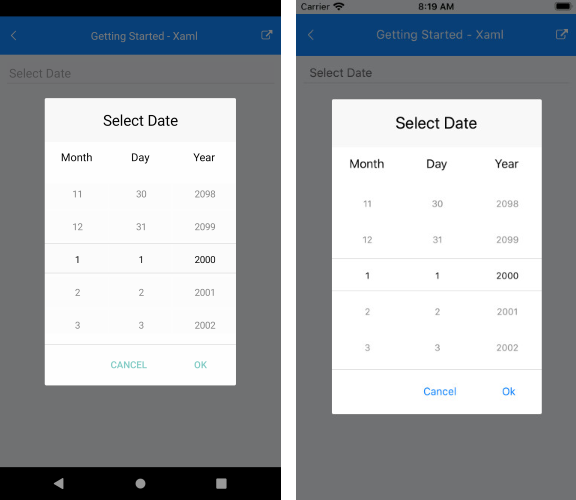

# Getting Started

This guide demonstrates how to add Telerik UI for .NET MAUI DatePicker control to your application.

At the end, you will be able to achieve the following result:



## Prerequisites

Before adding the DatePicker, first you need to [setup your .NET MAUI app](#setup-your-net-maui-app), and [download](#download-telerik-ui-for-net-maui) and [install Telerik UI for .NET MAUI](#install-telerik-ui-for-net-maui).

## Define RadDatePicker control

1. When the app is setup, you are ready to add a RadDatePicker control to your page:

 ```XAML
<telerikInput:RadDatePicker x:Name="datePicker" />
 ```

2. Add the following namespace:

 ```XAML
 xmlns:telerikInput="clr-namespace:Telerik.XamarinForms.Input;assembly=Telerik.Maui.Controls.Compatibility"
 ```

3. Register the Telerik controls through `Telerik.Maui.Controls.Compatibility.UseTelerik` extension method called inside the `Configure` method of the **Startup.cs** file of your project:

 ```C#
using Telerik.Maui.Controls.Compatibility;

 public void Configure(IAppHostBuilder appBuilder)
 {
    appBuilder        
        .UseTelerik()
        .UseMauiApp<App>();    
 }              
 ```
 
## See Also

- [Formatting]()
- [Date Range]()
- [Templates]()
- [Selection]()
- [Styling]()
